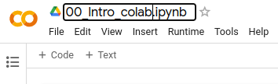
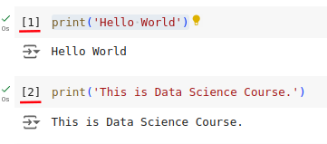
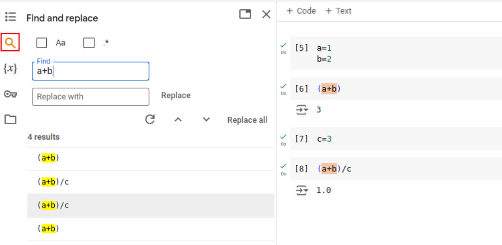
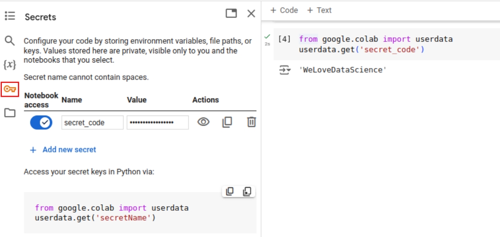

## **การจัดเก็บไฟล์ในรายวิชา**


ให้นักศึกษาสร้าง Directory ต่อไปนี้ใน Google Drive เพื่อเก็บงานในรายวิชานี้

1) ใน Google Drive นักศึกษาจะพบกล่อง "Colab Notebooks" ในกล่องนี้ให้สร้างกล่องเพิ่มเติมชื่อว่า "4663236_DataScience" สำหรับเก็บโค้ดของ Colab Notebook ทั้งหมดของวิชานี้

    


2) ภายในกล่อง "4663236_DataScience" ให้สร้างกล่องชื่อ "Datasets" เพื่อเก็บข้อมูลที่ใช้ในรายวิชานี้

    

3) การสร้างไฟล์ ipynb (IPython Notebook) ใหม่ผ่าน Google Drive ให้คลิ๊กขวาในกล่อง "4663236_DataScience" เลือก More และเลือก Google Colaboratory เพื่อสร้างเอกสาร IPython Notebook ใหม่ดังภาพประกอบ

    

    เมื่อ Notebook ใหม่ถูกสร้างและเปิดขึ้นมาแล้ว ทำการตั้งชื่อไฟล์ ในตัวอย่างจากภาพประกอบจะตั้งชื่อไฟล์ว่า "00_intro_colab"

    
    
    จะเห็นว่าเมื่อย้อนกลับไปยัง Google Drive ไฟล์ที่สร้างใหม่จะอยู่ใน Google Drive ของวิชาแล้ว และชื่อจะเป็นไปตามชื่อไฟล์ที่ตั้งไว้ (00_intro_colab.ipynb)

    

## **เริ่มต้นการทำงานด้วย IPython Notebook**
ในการใช้งาน Google Colab จะเป็นลักษณะของการเขียนสมุดโน๊ตผสมกับโค้ดของโปรแกรม ทำให้เราสามารถสร้างเอกสารที่มีคำอธิบายและโค้ดโปรแกรมซึ่งสามารถรันเพื่อแสดงผลลัพธ์ควบคู่กันไปได้ โดยมีการทำงานในส่วนต่าง ๆ ดังนี้

### การทำงานของ Cell
* การทำงานของ IPython Notebook จะเป็นลักษณะของการสร้าง Cell โดยสามารถสร้าง Cell จำนวนเท่าไหรก็ได้ตามต้องการ

    

* Cell จะมี 2 ประเภท คือ Code และ Text โดยสามารถเพิ่มจากเมนูด้านบนสุด หรือระหว่าง Cell ก็ได้ดังภาพประกอบ

    

    

* Cell แบบ Code จะใช้สำหรับโค้ดภาษาโปรแกรมเท่านั้น และสามารถรันเพื่อทำงานได้โดยการกดปุ่มหน้า Cell ดังภาพ

    

    เมื่อทำการรันผลแล้ว ผลลัพธ์จะแสดงด้านล่างของ Cell นั้น ๆ สำหรับตัวเลขหน้า Cell แบบ Code บอกถึงลำดับที่ถูกสั่งรัน

    

* Cell แบบ Text จะใช้สำหรับเขียนข้อความโดยสามารถจัดรูปแบบของข้อความได้ ในระหว่างเขียนผลลัพธ์จะแสดงด้านซ้ายมือ

    

    เมื่อเขียนข้อความเสร็จแล้วใน Cell จะแสดงเพียงผลลัพธ์ของข้อความให้เห็นเท่านั้น ดังภาพ
    

### เกี่ยวกับ Runtime และการรันโปรแกรม
ใน Google Colab จะมีเมนู Runtime ซึ่งจะสามารถใช้ในการสั่งรันโค้ดได้ เช่น 
* Run all รันโค้ดทั้งหมด โดยผู้ใช้ไม่ต้องเสียเวลากดรันทีละ Cell 
* Run before รันโค้ดก่อน Cell ที่ Cursor เลือกอยู่ 
* Run after รันโค้ดหลัง Cell ที่ Cursor เลือกอยู่ 
* Restart session เริ่มต้นการทำงานใหม่ โดยผลลัพธ์ที่เคยรันผลไว้ก่อนหน้าจะถูกเครียร์ออกไปด้วย 

    

* Change runtime type สามารถกำหนดภาษาที่ใช้ทำงานและ Hardware accelerator โดยเฉพาะเมื่อต้องประมวลผลเกี่ยวกับภาพควรเปลี่ยนเป็น GPU เพื่อให้เกิดประสิทธิภาพที่ดีขึ้น

    

### สารบัญ (Table of contents)
สำหรับเมนูสารบัญจะเป็นเมนูด้านซ้ายมือ ซึ่งแสดงสารบัญหรือหัวข้อต่าง ๆ ใน Notebook โดยสามารถเลือกแสดงบางหัวข้อและซ่อนบ้างหัวข้อไว้ได้ เพื่อความรวดเร็วในการทำงานการกำหนดหัวข้อทำให้เราสามารถเข้าถึงหัวข้อนั้น ๆ จากสารบัญได้


ในการกำหนดหัวข้อจะใช้สัญลักษณ์ # หน้าหัวข้อใน Cell แบบ Text หากมีหัวข้อย่อยลงไปอีกให้ทำการเพิ่มจำนวน # เข้าไป ดังตัวอย่าง


### การค้นหาและแทนที่ (Find and replace)
เมนูการค้นหาช่วยในการค้นหาข้อความทั้งใน Code และ Text และสามารถเลือกแทนที่ข้อความเหล่านั้นได้



### แสดงตัวแปร (Variables)
เมนูตัวแปรจะใช้เพื่อแสดงตัวแปรเฉพาะที่ทำงานอยู่ในตอนนั้น


### ตัวแปรระบบ (Configuration)
ใช้ในการเก็บตัวแปรที่เป็นการกำหนดค่าของระบบ เช่น คีย์ลับ หรือ คีย์ในการเข้าใช้งานบริการภายนอก ซึ่งไม่ควรเขียนไว้ในโค้ดตรง ๆ ดังตัวอย่างในภาพมีการกำหนดคีย์ลับในชื่อว่า secret_code ซึ่งสามารถทำการอ่านขึ้นมาเพื่อใช้งานได้




### จัดการไฟล์และโฟลเดอร์ (Files)
เมนูไฟล์จะใช้แสดงไฟล์ที่อยู่ในการทำงาน โดยไฟล์เหล่านี้หากไม่ได้มีการเชื่อมต่อกับ Google Drive เพื่อจัดเก็บก็จะหายไปเมื่อ Session หมดอายุ

ดังนั้นหากต้องการเชื่อมต่อกับ Google Drive สามารถทำได้โดยกดปุ่มเพื่อ Mount Google Drive เข้ามาเป็นส่วนหนึ่งของไฟล์และโฟลเดอร์ที่ทำงานดังภาพ ในการเชื่อมต่อจะมีการขออนุญาตเพื่อเข้าถึง Google Drive จะต้องอนุญาตในทุกหัวจึงจะใช้งานได้


เมื่อมีการเชื่อมต่อแล้วจะปรากฏโฟลเดอร์ชื่อว่า drive ดังภาพ


สำหรับโฟลเดอร์รายวิชานี้ที่ได้สร้างไว้ในตอนต้น จะอยู่ใน <b>drive > MyDrive > Colab Notebooks > 4663236_DataScience</b> ดังภาพ


## **ตัวอย่างการ Mount Google Drive และการอ่านเขียนไฟล์ไปยัง Google Drive (โดยใช้โค้ด)**


### Mount Google Drive
```
from google.colab import drive
drive.mount('/content/drive')
```


### Unmount Google Drive
```
drive.flush_and_unmount()
```


### Set path for datasets
```
dataset_path="/content/drive/MyDrive/Colab Notebooks/4663236_DataScience/Datasets/"
```


### สร้าง dataframe และจัดเก็บใน Google Drive 

#### สร้าง DataFrame ใหม่และบันทึกในไฟล์ CSV
```
import pandas as pd

# Create a simple dataframe
df = pd.DataFrame({
    'A': [1, 2, 3],
    'B': [4, 5, 6]
})

# Write it to a CSV file in your Google Drive
df.to_csv(dataset_path+'my_file.csv', index=False)
```


#### ใช้ DataFrame จากไฟล์ CSV

```
df = pd.read_csv(dataset_path+'my_file.csv')

# Print the dataframe
print(df)
```

## **โจทย์สร้างข้อมูลต่อไปนี้ในรูปแบบ CSV และจัดเก็บในกล่อง Dataset ในชื่อไฟล์ student.csv**

| **StudentID**  | **FirstName** | **LastName** |
| ------------- | ------------- | ------------- |
| 644295032  | คณากร | บัวหัน |
| 644295033 | ชัชพล  | โพธิ์รัตน์ |
| 644295034 | ซอลาฮูดีน |  มะรง |
