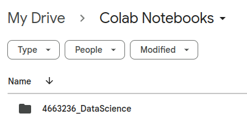
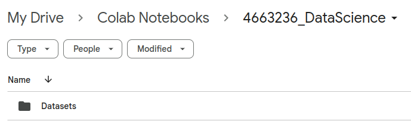

**การจัดเก็บไฟล์ในรายวิชา**
------------------------

ให้นักศึกษาสร้าง Directory ต่อไปนี้ใน Google Drive เพื่อเก็บงานในรายวิชานี้

1) ใน Google Drive นักศึกษาจะพบกล่อง "Colab Notebooks" ในกล่องนี้ให้สร้างกล่องเพิ่มเติมชื่อว่า "2567_1_4663236_DataScience" สำหรับเก็บโค้ดของ Colab Notebook ทั้งหมดของวิชานี้

    

    <sup>Note: แก้ไขจากภาพประกอบเป็น "2567_1_4663236_DataScience" </sup>


2) ภายในกล่อง "2567_1_4663236_DataScience" ให้สร้างกล่องชื่อ "Datasets" เพื่อเก็บข้อมูลที่ใช้ในรายวิชานี้

    
     <sup>Note: แก้ไขจากภาพประกอบเป็น "2567_1_4663236_DataScience" </sup>

------------------------
**ตัวอย่างการ Mount Google Drive และการอ่านเขียนไฟล์ไปยัง Google Drive**
------------------------

Mount Google Drive
```
from google.colab import drive
drive.mount('/content/drive')
```


Unmount Google Drive
```
drive.flush_and_unmount()
```


Set path for datasets
```
dataset_path="/content/drive/MyDrive/Colab Notebooks/2567_1_4663236_DataScience/Datasets/"
```


สร้าง dataframe และจัดเก็บใน Google Drive
```
import pandas as pd

# Create a simple dataframe
df = pd.DataFrame({
    'A': [1, 2, 3],
    'B': [4, 5, 6]
})

# Write it to a CSV file in your Google Drive
df.to_csv(dataset_path+'my_file.csv', index=False)
```


Read the CSV file back into a dataframe

```
df = pd.read_csv(dataset_path+'my_file.csv')

# Print the dataframe
print(df)
```

**โจทย์สร้างข้อมูลต่อไปนี้ในรูปแบบ CSV และจัดเก็บในกล่อง Dataset ในชื่อไฟล์ student.csv**

| **StudentID**  | **FirstName** | **LastName** |
| ------------- | ------------- | ------------- |
| 644295032  | คณากร | บัวหัน |
| 644295033 | ชัชพล  | โพธิ์รัตน์ |
| 644295034 | ซอลาฮูดีน |  มะรง |
