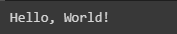
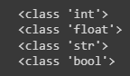
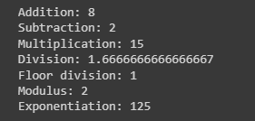
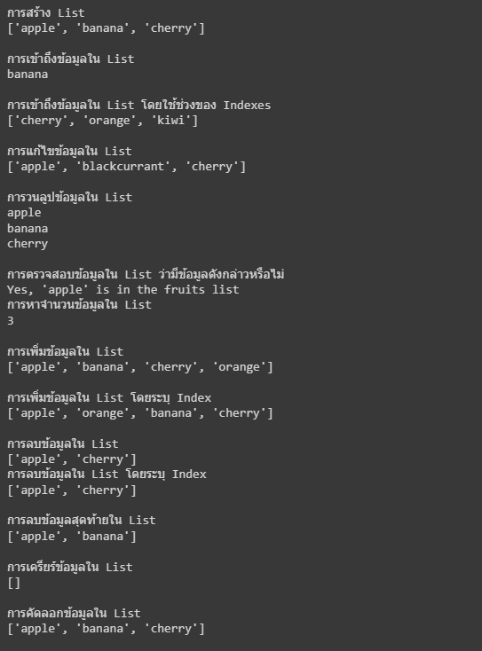
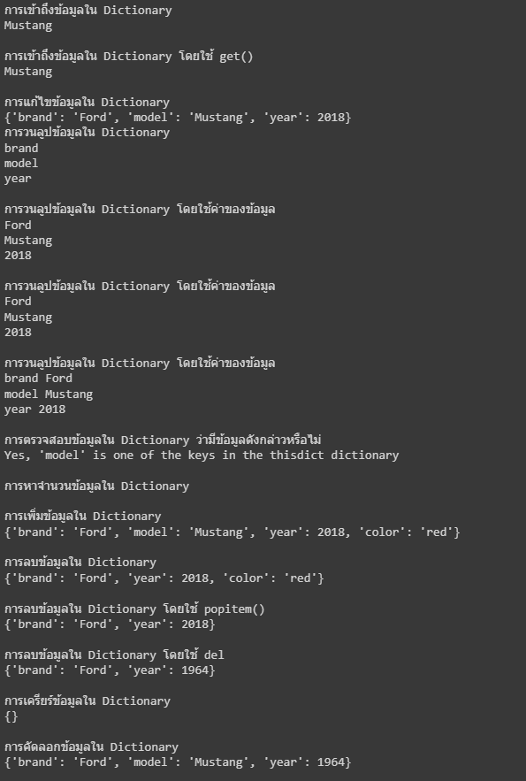
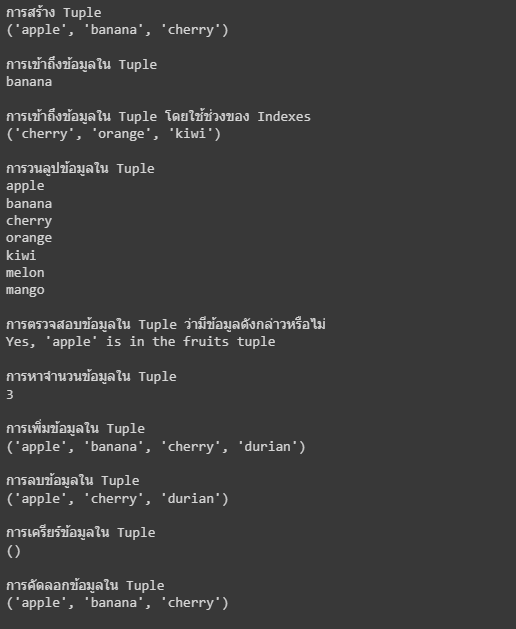
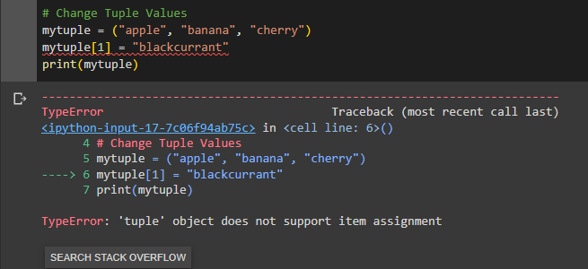
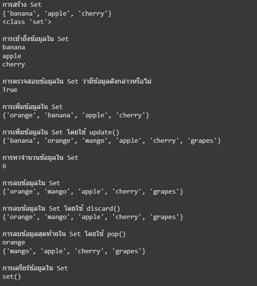
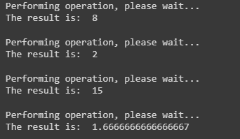

# Basic Python

## การพิมพ์ข้อความและตัวแปรใน Python

การพิมพ์ข้อความใน Python ใช้คำสั่ง print()

```python
print("Hello World!")
```
ได้ผลลัพธ์ดังนี้



เนื่องจากภาษา python ไม่จำเป็นต้องระบุชนิดของตัวแปรในการประกาศตัวแปร ดังนั้นเราสามารถประกาศตัวแปรได้โดยไม่ต้องระบุชนิดของตัวแปร

```python
x = 10
y = 20
z = x + y
print(z)
```


แต่หากต้องการตรวจสอบว่าตัวแปรนั้นมีชนิดเป็นอะไร สามารถใช้คำสั่ง type() ได้

```python
# Python Data Types

# Integer
x = 10
print(type(x))

# Float
y = 10.5
print(type(y))

# String
z = "Hello, Python"
print(type(z))

# Boolean
a = True
print(type(a))
```

ได้ผลลัพธ์ดังนี้



## การใช้งาน Operation

```python
# Python Operation
print("Addition:", 5 + 3)
print("Subtraction:", 5 - 3)
print("Multiplication:", 5 * 3)
print("Division:", 5 / 3)
print("Floor division:", 5 // 3)
print("Modulus:", 5 % 3)
print("Exponentiation:", 5 ** 3)
```

ได้ผลลัพธ์ดังนี้



## การใช้งานเงื่อนไข
การใช้งานเงื่อนไขใน Python ใช้คำสั่ง if, elif, else

```python
# Python Conditionals
num = 10
if (num > 5):
    print("Number is greater than 5")
    print(".....")
elif num == 5:
    print("Number is equal to 5")
else:
    print("Number is less than 5")
```

**โจทย์ - แสดงข้อความตามเงื่อนไขต่อไปนี้**

รับค่าอายุ (age)

age <=10 แสดงข้อความ "Baby"

age >10-20 แสดงข้อความ "Young Adult"

age >20-40 แสดงข้อความ  "Adult"

age >40-60 แสดงข้อความ "Middle Age"

age >60 แสดงข้อความ "Senior Citizen"

## การใช้งาน Loop
การใช้งาน Loop ใน Python ใช้คำสั่ง for และ while

```python
# for Loop
for i in range(5):
    print(i)
```

```python
# while Loop
i = 0
while i < 5:
    print(i)
    i += 1
```


**ตัวอย่าง Loop**
```
# For loop
for i in range(5):
    print(i)


# While loop
i = 0
while i < 5:
    print(i)
    i += 1
```

**โจทย์ - พิมพ์ข้อความให้ได้ตามรูป**
```
******
****
***
**
*
```

**Hint**: การพิมพ์ไม่ขึ้นบรรทัดใหม่
```
print("Hello World!", end = '')
```

## การรับค่าจากหน้าจอ

การรับค่าจากหน้าจอใน Python ใช้คำสั่ง input()

```python
input("ใส่ค่าตัวเลข")
```

ค่าที่ได้เป็นข้อความหากต้องการแปลง

```
int(input("ใส่ค่าตัวเลข"))
```
* การแปลงเป็นข้อความใช้ str()

* การแปลงเป็นเลขจำนวนเต็มใช้ int()


## ชุดข้อมูล Collection

python มีชนิดข้อมูลที่เป็น built-in collection อยู่หลายชนิด เช่น 
* **List** เป็นชุดข้อมูลที่เป็นลำดับ สามารถเปลี่ยนแปลงข้อมูลได้ (mutable) และอนุญาติให้มีข้อมูลที่ซ้ำกันได้
* **Tuple** เป็นชุดข้อมูลที่เป็นลำดับ ไม่สามารถเปลี่ยนแปลงข้อมูลได้ (immutable) และอนุญาติให้มีข้อมูลที่ซ้ำกัน
* **Set** เป็นชุดข้อมูลที่ไม่มีลำดับ ข้อมูลใน Set จะเป็นชนิดข้อมูลที่ไม่สามารถเปลี่ยนแปลงข้อมูลได้(immutable) แต่ตัว Set เองเสามารถเพิ่มและลบได้ (mutable) และไม่อนุญาติให้มีข้อมูลที่ซ้ำกัน
* **Dictionary** เป็นชุดข้อมูลที่ไม่มีลำดับ สามารถเปลี่ยนแปลงข้อมูลได้ (mutable) และไม่อนุญาติให้มีข้อมูลที่ซ้ำกันได้

อ้างอิง: [Python Lists - W3Schools](https://www.w3schools.com/python/python_lists.asp)

โดยจะเห็นความมีการอธิบายลักษณะของชุดข้อมูลด้วย Mutable และ Immutable ซึ่ง Mutable และ Immutable ในภาษา Python มีความหมายถึงนี้

* Mutable คือ ชนิดข้อมูลที่สามารถเปลี่ยนแปลงข้อมูลได้ เช่น List, Dictionary, Set และ user-defined classes

* Immutable คือ ชนิดข้อมูลที่ไม่สามารถเปลี่ยนแปลงข้อมูลได้ เข่น Tuple, Integers, Floats, Strings, Tuples และ Booleans

อ้างอิง (โดยสรุปจาก) : [Understanding Mutable and Immutable in Python](https://www.mygreatlearning.com/blog/understanding-mutable-and-immutable-in-python)


### คำสั่งในการใช้งาน List

**การสร้าง List**
```python
# List
mylist = ["apple", "banana", "cherry"]
print(mylist)
```

**การเข้าถึงข้อมูลใน List**
```python
# Access Items
mylist = ["apple", "banana", "cherry"]
print(mylist[1])
```


**การเข้าถึงข้อมูลใน List โดยใช้ช่วงของ Indexes**
```python
# Range of Indexes
mylist = ["apple", "banana", "cherry", "orange", "kiwi", "melon", "mango"]
print(mylist[2:5])
```

**การแก้ไขข้อมูลใน List**
```python
# Change Item Value
mylist = ["apple", "banana", "cherry"]
mylist[1] = "blackcurrant"
print(mylist)
```

**การวนลูปข้อมูลใน List**
```python
# Loop Through a List
mylist = ["apple", "banana", "cherry"]
for x in mylist:
  print(x)
```


**การตรวจสอบข้อมูลใน List ว่ามีข้อมูลดังกล่าวหรือไม่**
```python
# Check if Item Exists
mylist = ["apple", "banana", "cherry"]
if "apple" in mylist:
  print("Yes, 'apple' is in the fruits list")
```

**การหาจำนวนข้อมูลใน List**
```python
# List Length
mylist = ["apple", "banana", "cherry"]
print(len(mylist))
```

**การเพิ่มข้อมูลใน List**
```python
# Add Items
mylist = ["apple", "banana", "cherry"]
mylist.append("orange")
print(mylist)
```

**การเพิ่มข้อมูลใน List โดยระบุ Index**
```python
# Insert Items
mylist = ["apple", "banana", "cherry"]
mylist.insert(1, "orange")
print(mylist)
```

**การลบข้อมูลใน List**
```python
# Remove Item
mylist = ["apple", "banana", "cherry"]
mylist.remove("banana")
print(mylist)
```

**การลบข้อมูลใน List โดยระบุ Index**
```python
# Remove Specified Index
mylist = ["apple", "banana", "cherry"]
mylist.pop(1)
print(mylist)
```


**การลบข้อมูลสุดท้ายใน List**
```python
# Remove Last Item
mylist = ["apple", "banana", "cherry"]
mylist.pop()
print(mylist)
```

**การเครียร์ข้อมูลใน List**
```python
# Empty List
mylist = ["apple", "banana", "cherry"]
mylist.clear()
print(mylist)
```

**การคัดลอกข้อมูลใน List**
```python
# Copy a List
mylist = ["apple", "banana", "cherry"]
mylist2 = mylist.copy()
print(mylist2)
```


ได้ผลลัพธ์ของคำสั่งทั้งหมดดังนี้




### คำสั่งในการใช้งาน Dictionary

**การสร้าง Dictionary**
```python
# Dictionary
mydict = {
  "brand": "Ford",
  "model": "Mustang",
  "year": 1964
}

print(mydict)
```

**การเข้าถึงข้อมูลใน Dictionary**
```python
# Accessing Items
x = mydict["model"]
print(x)
```

**การเข้าถึงข้อมูลใน Dictionary โดยใช้ get()**
```python
# Get the value of the "model" key
x = mydict.get("model")
print(x)
```


**การแก้ไขข้อมูลใน Dictionary**
```python
# Change Values
mydict["year"] = 2018
print(mydict)
```

**การวนลูปข้อมูลใน Dictionary**
```python
# Loop Through a Dictionary
for x in mydict:
  print(x)
```


**การวนลูปข้อมูลใน Dictionary โดยใช้ค่าของข้อมูล**
```python

# Loop Through a Dictionary
for x in mydict:
  print(mydict[x])
```

**การวนลูปข้อมูลใน Dictionary โดยใช้ค่าของข้อมูล**
```python
# Loop Through a Dictionary
for x in mydict.values():
  print(x)
```

**การวนลูปข้อมูลใน Dictionary โดยใช้ค่าของข้อมูล**
```python
# Loop Through a Dictionary
for x, y in mydict.items():
  print(x, y)
```

**การตรวจสอบข้อมูลใน Dictionary ว่ามีข้อมูลดังกล่าวหรือไม่**
```python
# Check if Key Exists
if "model" in mydict:
  print("Yes, 'model' is one of the keys in the thisdict dictionary")
```

**การหาจำนวนข้อมูลใน Dictionary**
```python
# Dictionary Length
len(mydict)
```

**การเพิ่มข้อมูลใน Dictionary**
```python
# Adding Items
mydict["color"] = "red"
print(mydict)
```

**การลบข้อมูลใน Dictionary**
```python
# Removing Items
mydict.pop("model")
print(mydict)
```

**การลบข้อมูลใน Dictionary โดยใช้ popitem()**
```python
# Removing Items
mydict.popitem()
print(mydict)
```

**การลบข้อมูลใน Dictionary โดยใช้ del**
```python
mydict = {
  "brand": "Ford",
  "model": "Mustang",
  "year": 1964
}

# Removing Items
del mydict["model"]
print(mydict)
```


**การเครียร์ข้อมูลใน Dictionary**
```python
# Clear
mydict.clear()
print(mydict)
```

**การคัดลอกข้อมูลใน Dictionary**
```python
mydict = {
  "brand": "Ford",
  "model": "Mustang",
  "year": 1964
}

# Copy
mydict2 = mydict.copy()
print(mydict2)
```

ได้ผลลัพธ์ของคำสั่งทั้งหมดดังนี้



### คำสั่งในการใช้งาน Tuple

**การสร้าง Tuple**
```python
# Tuple
mytuple = ("apple", "banana", "cherry")
print(mytuple)
```

**การเข้าถึงข้อมูลใน Tuple**
```python
# Access Tuple Items
print(mytuple[1])
```

**การเข้าถึงข้อมูลใน Tuple โดยใช้ช่วงของ Indexes**
```python
# Range of Indexes
mytuple = ("apple", "banana", "cherry", "orange", "kiwi", "melon", "mango")
print(mytuple[2:5])
```

**การวนลูปข้อมูลใน Tuple**
```python
# Loop Through a Tuple
for x in mytuple:
  print(x)
```

**การตรวจสอบข้อมูลใน Tuple ว่ามีข้อมูลดังกล่าวหรือไม่**
```python
# Check if Item Exists
if "apple" in mytuple:
  print("Yes, 'apple' is in the fruits tuple")
```

**การหาจำนวนข้อมูลใน Tuple**
```python
# Tuple Length
print(len(mytuple))
```

**การเพิ่มข้อมูลใน Tuple**
```python
# Add Items
y = list(mytuple)
y.append("durian")
mytuple = tuple(y)
print(mytuple)
```

**การลบข้อมูลใน Tuple**
```python
# Remove Items
y = list(mytuple)
y.remove("banana")
mytuple = tuple(y)
print(mytuple)
```


**การเครียร์ข้อมูลใน Tuple**
```python
# Clear Tuple
mytuple = ("apple", "banana", "cherry")
mytuple = ()
print(mytuple)
```

**การคัดลอกข้อมูลใน Tuple**
```python
# Copy a Tuple
mytuple = ("apple", "banana", "cherry")
mytuple2 = mytuple
print(mytuple2)
```


ได้ผลลัพธ์ของคำสั่งทั้งหมดดังนี้



**การแก้ไขข้อมูลใน Tuple**
```python
# Change Tuple Values
mytuple = ("apple", "banana", "cherry")
mytuple[1] = "blackcurrant"
print(mytuple)
```

ได้ผลลัพธ์ของคำสั่งดังนี้



<ins>**จะเห็นว่าเกิด error**</ins> เนื่องจาก Tuple เป็นข้อมูลแบบ Immutable ซึ่งไม่อนุญาติให้เปลี่ยนแปลงข้อมูลได้

### คำสั่งในการใช้งาน Set

**การสร้าง Set**
```python
# Set
myset = {"apple", "banana", "cherry"}
print(myset)
```

**การเข้าถึงข้อมูลใน Set**
```python
# Access Items
for x in myset:
  print(x)
```

**การตรวจสอบข้อมูลใน Set ว่ามีข้อมูลดังกล่าวหรือไม่**
```python
# Check if Item Exists
print("banana" in myset)
```

**การเพิ่มข้อมูลใน Set**
```python
# Add Items
myset.add("orange")
print(myset)
print(type(myset))
```

**การเพิ่มข้อมูลใน Set โดยใช้ update()**
```python
# Add multiple items to a set, using the update() method
myset.update(["orange", "mango", "grapes"])
print(myset)
```

**การหาจำนวนข้อมูลใน Set**
```python
# Get the number of items in a set
print(len(myset))
```

**การลบข้อมูลใน Set**
```python
# Remove Item
myset.remove("banana")
print(myset)
```

**การลบข้อมูลใน Set โดยใช้ discard()**
```python
# Remove Item
myset.discard("banana")
print(myset)
```

**การลบข้อมูลสุดท้ายใน Set โดยใช้ pop()**
```python
# Remove the last item by using the pop() method
x = myset.pop()
print(x)
print(myset)
```

**การเครียร์ข้อมูลใน Set**
```python
# Clear
myset.clear()
print(myset)
```

ได้ผลลัพธ์ของคำสั่งทั้งหมดดังนี้




### คำสั่งในการใช้งาน Range
การสร้างชุดข้อมูลที่เป็นตัวเลขติดกัน สามารถใช้คำสั่ง range() ได้ เช่นตัวอย่างต่อไปนี้

การสร้างข้อมูลตั้งแต่ 0 ถึง 5
```python
# Range
myrange = range(6)
print(myrange)
```

การสร้างข้อมูลตั้งแต่ 2 ถึง 6
```python
# Range
myrange = range(2, 7)
print(myrange)
```

การสร้างข้อมูลตั้งแต่ 2 ถึง 30 โดยเพิ่มทีละ 3
```python
# Range
myrange = range(2, 30, 3)
print(myrange)
```

## Function
การสร้างฟังก์ชันใน Python ใช้คำสั่ง def

```python
# Function
def my_function():
  print("Hello from a function")
```

**การเรียกใช้งานฟังก์ชัน**
```python
# Calling a Function
def my_function():
  print("Hello from a function")

my_function()
```

**การส่งค่าเข้าไปในฟังก์ชัน**
```python
# Parameters
def my_function(fname):
  print(fname + " Refsnes")

my_function("Emil")
my_function("Tobias")
my_function("Linus")
```

**การส่งค่าเข้าไปในฟังก์ชัน โดยใช้ keyword arguments**
```python
# Keyword Arguments
def my_function(child3, child2, child1):
  print("The youngest child is " + child3)

my_function(child1 = "Emil", child2 = "Tobias", child3 = "Linus")
```

**การส่งค่าเข้าไปในฟังก์ชัน โดยใช้ keyword arguments**
```python
# Arbitrary Arguments, *args
def my_function(*kids):
  print("The youngest child is " + kids[2])

my_function("Emil", "Tobias", "Linus")
```

## Callback Function
Callback Function คือ ฟังก์ชันที่ส่งเข้าไปในฟังก์ชันอีกฟังก์ชันหนึ่ง เพื่อให้ฟังก์ชันนั้นทำงานเสร็จแล้ว จะเรียกใช้ฟังก์ชันที่ส่งเข้าไปในฟังก์ชันนั้น 

ตัวอย่างข้างล่างจะเห็นว่า ฟังก์ชัน calculator รับฟังก์ชัน callback เข้าไป และเมื่อฟังก์ชัน calculator ทำงานเสร็จแล้ว จะเรียกใช้ฟังก์ชัน callback ที่ส่งเข้าไปในฟังก์ชันนี้ ซึ่งเป็นฟังก์ชัน print_callback  โดยมีการเพิ่ม time.sleep(2) เพื่อเว้นระยะเวลาระยะหนึ่งก่อนทำการเรียกใช้ callback 

```python
import time

# Here is a simple example of a callback function
def print_callback(result):
    """This function prints the result"""
    print("The result is: ", result)

def calculator(a, b, operation, callback):
    """This function performs an operation on two numbers and then calls the callback function with the result"""
    if operation == "add":
        result = a + b
    elif operation == "subtract":
        result = a - b
    elif operation == "multiply":
        result = a * b
    elif operation == "divide":
        result = a / b
    else:
        print("Invalid operation")
        return

    # Add a delay before calling the callback function
    print("Performing operation, please wait...")
    time.sleep(2)  # Delay for 2 seconds

    # Call the callback function with the result
    callback(result)

# Use the calculator function with the print_callback function
calculator(5, 3, "add", print_callback)
calculator(5, 3, "subtract", print_callback)
calculator(5, 3, "multiply", print_callback)
calculator(5, 3, "divide", print_callback)
```

ได้ผลลัพธ์ของคำสั่งดังนี้



<ins>หมายเหตุ</ins> โค้ดและข้อความบางส่วนมีการใช้ Github Copilot ในการเขียน และปรับแก้บ้างส่วนเพื่อให้เหมาะสมกับเนื้อหา จึงอาจมีเนื้อหาจากแหล่งข้อมูลอื่นๆ ที่ไม่ได้ระบุมาในเอกสารนี้

# แบบฝึกหัด
1) เขียนโปรแกรมแปลงปี คศ. เป็น พศ. โดยใช้ function
2) เขียนโปรแกรมแสดงสูตรคูณ
3) เขียนโปรแกรมคิดเกรดจากคะแนน โดยให้ตัดเกรดตามคะแนนรายวิชานี้ (ดูในเอกสารของรายวิชาเพื่อดูเกณฑ์การตัดเกรด)