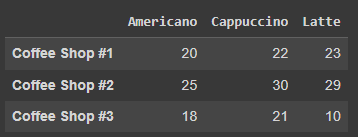
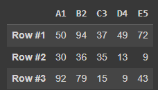

# การใช้งาน Pandas และการเตรียมข้อมูล (Data Preparation)


## การสร้างข้อมูลใน DataFrame

การเรียกใช้ Library ของ Pandas
```
import pandas as pd
```

### สร้าง DataFrame จาก dict

**ตัวอย่าง** : สร้าง DataFrame  2 คอลัมน์ ชื่อ "Yes" และ "No" โดยมีค่าเป็นตัวเลข 2 แถว
```
pd.DataFrame({'Weight': [50, 45], 'Height': [155, 166]})
```

**ตัวอย่าง** : สร้าง DataFrame 2 คอลัมน์ ชื่อ "Barbie" และ "Ken" โดยมีค่าเป็นข้อความ 2 แถว
```
pd.DataFrame({'Barbie': ['I liked it.', 'It was awful.'], 'Ken': ['Pretty good.', 'Bland.']})
```

**ตัวอย่าง** : สร้าง DataFrame 2 คอลัมน์ ชื่อ "Barbie" และ "Ken" โดยมีค่าเป็นข้อความ 2 แถว สำหรับสินค้า A และ B
```
pd.DataFrame({'Barbie': ['I liked it.', 'It was awful.'], 
              'Ken': ['Pretty good.', 'Bland.']},
             index=['Product A', 'Product B'])
```
**<ins>โจทย์</ins> : สร้าง DataFrame จาก dict ให้มีข้อมูลดังภาพต่อไปนี้**




### สร้าง DataFrame จาก List

**ตัวอย่าง** : สร้างข้อมูลจาก List
```
fruits_list = ['Apple', 'Banana', 'Orange','Mango']
fruits_df = pd.DataFrame(fruits_list)
fruits_df
```


**ตัวอย่าง** : สร้างข้อมูลจาก List และระบุชื่อแถวข้อมูล

ระบุชื่อแถวของข้อมูล
```
fruits_df = pd.DataFrame(fruits_list, index=['Fruit1', 'Fruit2', 'Fruit3', 'Fruit4'])
fruits_df
```


**ตัวอย่าง** : สร้างข้อมูลจาก List และระบุชื่อคอลัมภ์ (Column labels)

กำหนดชื่อให้ Column
```
fruits_df = pd.DataFrame(fruits_list, columns=['Fruits'])
fruits_df
```

**<ins>โจทย์</ins> : สร้าง DataFrame จาก List จำนวน 3 List ซึ่งได้จากการสุ่มตัวเลขในโค้ดที่ให้มา (โดยแต่ละ List จะเป็นข้อมูลในแต่ละแถว) ให้ DataFrame มีข้อมูลดังภาพต่อไปนี้**

```
import random
#Generate 10 random numbers between 1 and 100
row1 = random.sample(range(1, 100), 5)
row2 = random.sample(range(1, 100), 5)
row3 = random.sample(range(1, 100), 5)
print(row1)
print(row2)
print(row3)
```



### สร้าง DataFrame จากไฟล์ csv

อ่านไฟล์ csv เพื่อแสดงใน DataFrame
```
df = pd.read_csv('ds_students.csv')
df
```

**<ins>โจทย์</ins> : นำไฟล์ ds_students.csv ใน github นี้ ไปจัดเก็บใน Google drive กล่อง Datasets ของรายวิชา และทำการอ่านไฟล์จาก Google drive แทน**

## แสดงข้อมูลใน DataFrame 

แสดงข้อมูลแรกบางส่วน
```
df.head()
```

แสดง 10 ข้อมูลแรก
```
df.head(10)
```

แสดงข้อมูลจากส่วนท้ายบางส่วน
```
df.tail()
```

แสดง 5 ข้อมูลท้ายสุด
```
df.tail(5)
```

แสดง Index ของข้อมูล
```
df.index
```

แสดงชื่อคอลัมน์ของข้อมูล
```
df.columns
```

แสดงชื่อชนิดของข้อมูล
```
df.dtypes
```

แสดง Shape ข้อมูล
```
df.shape
```

แสดง size ข้อมูล
```
df.size
```

## การเลือกข้อมูลใน DataFrame 

เลือกข้อมูลแสดงตามชื่อคอลัมน์

```
reviews = pd.read_csv('winemag-data-5k-v2.csv',index_col=0)
```

```
reviews.country
```

```
reviews.points
```

```
reviews['country']
```

```
reviews[['country', 'points']]
```


## การใช้ Indexing ใน pandas

อ้างอิง: https://www.kaggle.com/code/residentmario/indexing-selecting-assigning

**<ins>index-based selection</ins>**: การเลือกข้อมูลจากตำแหน่งซึ่งเป็นตัวเลขโดยใช้ iloc จากตัวอย่างข้างล่างจะได้ข้อมูลแถวแรก (index ที่ 0) มาแสดง


```
reviews.iloc[0]
```

สามารถกำหนดการเลือกแถวและคอลัมน์ได้พร้อมกัน (แถวก่อน ตามด้วยคอลัพน์) ดังตัวอย่าง (การใช้ : โดยไม่มีตัวเลขหน้าหลังหมายถึงการเลือกทั้งหมด) ตัวอย่างนี้จึงเป็นการเลือกทุกแถวของคอลัมน์แรก

```
reviews.iloc[:, 0]
```

เลือก 3 แถวแรก ของคอลัมน์แรก
```
reviews.iloc[:3, 0]
```

เลือกแถวที่สองและสาม ของคอลัมน์แรก
```
reviews.iloc[1:3, 0]
```

สามารถส่งเป็น List ของแถวที่ต้องการเลือกเข้าไปได้
```
reviews.iloc[[0, 1, 2], 0]
```

เลือกข้อมูล 5 แถวสุดท้าย
```
reviews.iloc[-5:]
```

**<ins>label-based selection</ins>**: เป็นการเลือกโดยอ้าง index value ซึ่งไม่ใช่ตัวเลขตำแหน่ง

ตัวอย่าง
```
reviews.loc[0, 'country']
```

```
reviews.loc[:, ['taster_name', 'taster_twitter_handle', 'points']]
```


**<ins>โจทย์</ins> : เปรียบเทียบผลของคำสั่ง loc และ iloc ต่อไปนี้ อธิบายความแตกต่างของผลลัพธ์**

```
df.loc[0:5]
```

```
df.iloc[0:5]
```

การกำหนด index จากคอลัมน์ที่กำหนด

```
reviews.set_index("title")
```

**<ins>การกำหนดเงื่อนไขในการเลือกข้อมูล</ins>**

**ตัวอย่าง** : ผลการเปรียบเทียบประเทศที่มีค่าตรงกับ Italy
```
reviews.country == 'Italy'
```

**ตัวอย่าง** : ต้องการแสดงเฉพาะข้อมูลของประเทศ Italy
```
reviews.loc[reviews.country == 'Italy']
```

**ตัวอย่าง** : ต้องการแสดงเฉพาะข้อมูลของประเทศ Italy ที่มีค่า point มากกว่า 90
```
reviews.loc[(reviews.country == 'Italy') & (reviews.points >= 80)]
```

**ตัวอย่าง** : ต้องการแสดงเฉพาะข้อมูลของประเทศ Italy **หรือ** ข้อมูลที่มี point มากกว่าเท่ากับ 80
```
reviews.loc[(reviews.country == 'Italy') | (reviews.points >= 80)]
```


**<ins>โจทย์</ins> : แสดงข้อมูลไวน์ของประเทศ Portugal และ Italy ที่มีราคามากกว่า 55$**


**ตัวอย่าง** : ต้องการแสดงเฉพาะข้อมูลจาก List ของประเทศที่ให้มา
```
reviews.loc[reviews.country.isin(['Italy', 'France'])]
```


**การให้ค่ากับข้อมูล**
```
reviews['critic'] = 'everyone'
```

```
reviews['index_backwards'] = range(len(reviews), 0, -1)
```

**<ins>โจทย์</ins> : เพิ่มคอลัมน์ใหม่จากค่าผลรวมของ price และ points ชื่อ new_value**

## การจัดการข้อมูล

การสร้าง Column ใหม่ให้ DataFrame
```
reviews['new'] = reviews['price'] + reviews['point']
```

การลบ Column ใน DataFrame
```
reviews.drop('new',axis=1,inplace=True)
```

การลบ Row ใน DataFrame
```
reviews.drop(3,axis=0)
```

**<ins>โจทย์</ins> : ลบคอลัมน์ชื่อ new_value**

## Summary Functions and Maps

สรุปเกี่ยวกับข้อมูล
```
reviews.info()
```

```
reviews.describe()
```

สรุปเกี่ยวกับข้อมูลในคอลัมน์ที่ระบุ จะแสดงค่าสถิติเบื้องต้นมาให้
```
reviews.points.describe()
```


แสดงค่าสถิติที่สนใจ เช่น mean
```
reviews.points.mean()
```


**<ins>โจทย์</ins> : หาว่าไวน์ที่ราคาสูงสุดคือราคาเท่าไรและมาจากประเทศใด**


การแสดงค่า null  และ na

```
reviews.isna().sum()
```

```
reviews.isnull().sum()
```

```
reviews['name'].isnull()
```

เติมนับจำนวนข้อมูลตามค่า
```
reviews['taster_name'].value_counts()
```

เติมค่าว่างด้วยค่าเฉลี่ย
```
reviews.fillna(reviews.mean())
```

แสดงข้อมูลราคาที่ไม่ใช่ค่า null
```
reviews.loc[reviews.price.notnull()]
```

แสดงค่าที่ไม่ซ้ำกัน
```
reviews.taster_name.unique()
```


นับจำนวนข้อมูลที่ไม่ซ้ำกัน (ไม่นับค่า null)
```
reviews.taster_name.nunique()
```

การใช้คำสั่ง map
```
review_points_mean = reviews.points.mean()
reviews.points.map(lambda p: p - review_points_mean)
```


การใช้คำสั่ง apply
```
def remean_points(row):
    row.points = row.points - review_points_mean
    return row

reviews.apply(remean_points, axis='columns')
```

เรียงข้อมูลจากมากไปน้อย
```
 reviews.sort_values(by='point', ascending=False)
 ```


## Data Visualization (แบบง่าย)

แสดงกราฟ Histogram
```
reviews.points.hist()
```

แสดง Bar Chart
```
reviews['country'].value_counts().plot.bar()
```

แสดง BoxPlot
```
reviews.boxplot(column=['point'])
```


