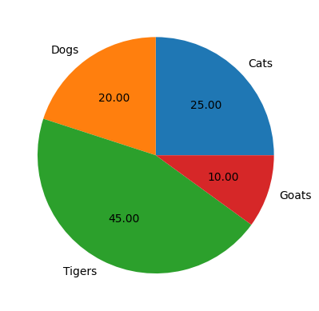

# การแสดงผลข้อมูล (Data Visualization)

อ้างอิง:

* [Matplotlib](https://matplotlib.org/stable/tutorials)
* [Seaborn](https://seaborn.pydata.org/tutorial/introduction.html)
* [Data Visualization - Kaggle](https://www.kaggle.com/learn/data-visualization)
* [Data Visualization - Aleksey Bilogur
(Kaggle)](https://www.kaggle.com/residentmario/welcome-to-data-visualization)
* [Matplotlib Guide For People In A Hurry - Medium](https://towardsdatascience.com/all-your-matplotlib-questions-answered-420dd95cb4ff)


## การใช้งาน Matplotlib

Matplotlib เป็น Library ที่ใช้สำหรับการสร้างกราฟ โดยมีการเรียกใช้ดังนี้

```python
import matplotlib.pyplot as plt
```

### การสร้างกราฟแบบง่าย

```python
plt.plot([1, 2, 3, 4])
plt.ylabel('some numbers')
plt.show()
```


### การสร้างกราฟแบบระบุแกน x,y

```python
plt.plot([1, 2, 3, 4], [1, 4, 9, 16])
plt.ylabel('some numbers')
plt.show()
```


### การระบุชื่อแกน x,y

```python
years = [1983, 1984, 1985, 1986, 1987]
total_populations = [8939007, 8954518, 8960387, 8956741, 8943721]

#Line Graph
plt.plot(years,total_populations)
#ชื่อกราฟ
plt.title("Year vs Population")
#ชื่อข้อมูลในแกน X (แสดงปี 1983-1987)
plt.xticks(years)
#ชื่อแกน X
plt.xlabel("Year")
#ชื่อแกน Y
plt.ylabel("Population")
plt.show()
```


### การกำหนดสีของเส้น
สามารถกำหนดสีของเส้นได้ด้วยการระบุตัวอักษรตัวแรกของสีที่ต้องการ โดยมีตัวอักษรตัวแรกของสีที่ใช้ได้ดังนี้  
* b: blue
* g: green
* r: red
* c: cyan
* m: magenta
* y: yellow
* k: black
* w: white

จากตัวอย่างต่อไปนี้ ro คือ สีแดง (red) และ o คือ รูปแบบของเส้น (circle)

```python
plt.plot([1, 2, 3, 4], [1, 4, 9, 16], 'ro')
plt.axis([0, 6, 0, 20])
plt.show()
```


### การกำหนดรูปแบบของเส้น

สามารถกำหนดรูปแบบของเส้น ได้ดังนี้
* : คือ เส้นจุด (dotted line)
* -. คือ เส้นประจุด (dash-dot line)
* -- คือ เส้นประ (dashed line)
* - คือ เส้นตรง (solid line)


Ref: https://python-graph-gallery.com/121-line-chart-customization/

**ตัวอย่าง**

```python
import numpy as np

#สร้างข้อมูลสำหรับแกน x และ y
t = np.arange(0., 3., 0.2)

#สร้างกราฟ
plt.plot(t, t, color = 'red' , linewidth = 4, linestyle = ":")
plt.plot(t, t+1, color = 'green' , linewidth = 4, linestyle = "-.")
plt.plot(t, t+2, color = 'orange' , linewidth = 4, linestyle = "--")
plt.plot(t, t+3, color = 'blue' , linewidth = 4, linestyle = "-")

plt.show()

#สามารถเขียนในคำสั่ง plot ในครั้งเดียวได้ดังนี้
#plt.plot(t, t, 'r:', t, t+1, 'g-.', t, t+2, 'm--', t, t+3, 'b-', linewidth=4)
```


### การกำหนดรูปแบบของ Marker
Marker มีหลายรูปแบบ สามารถกำหนดได้ดังนี้
* . คือ จุด (point marker)
* , คือ จุด (pixel marker)
* o คือ วงกลม (circle marker)
* v คือ สามเหลี่ยมลง (triangle_down marker)
* ^ คือ สามเหลี่ยมขึ้น (triangle_up marker)
* < คือ สามเหลี่ยมซ้าย (triangle_left marker)
* \> คือ สามเหลี่ยมขวา (triangle_right marker)
* 1 คือ สามเหลี่ยมลง (tri_down marker)
* 2 คือ สามเหลี่ยมขึ้น (tri_up marker)
* 3 คือ สามเหลี่ยมซ้าย (tri_left marker)
* 4 คือ สามเหลี่ยมขวา (tri_right marker)
* s คือ สี่เหลี่ยม (square marker)
* p คือ ห้าเหลี่ยม (pentagon marker)
* \* คือ ดาว (star marker)
* h คือ หกเหลี่ยม (hexagon1 marker)
* H คือ หกเหลี่ยม (hexagon2 marker)
* \+ คือ บวก (plus marker)
* x คือ กากบาท (x marker)
* D คือ เพชร (diamond marker)
* d คือ เพชร (thin_diamond marker)
* | คือ แนวตั้ง (vline marker)
* \_ คือ แนวนอน (hline marker)


Ref: https://medium.com/p/420dd95cb4ff

**ตัวอย่าง**

```python 
import numpy as np

#สร้างข้อมูลสำหรับแกน x และ y
t = np.arange(0., 3., 0.2)

# กำหนดขนาดของกราฟ
plt.subplots(figsize=(8, 12))

#สร้างกราฟ
plt.plot(t, t, color = 'lightblue' , markerfacecolor='red',markeredgecolor='red', markersize=12 , marker = '.')
plt.plot(t, t+1, color = 'lightblue', markerfacecolor = 'green', markeredgecolor='green', markersize=12  , marker = 'p')
plt.plot(t, t+2, color = 'lightblue', markerfacecolor = 'orange', markeredgecolor='orange', markersize=12  , marker = 'o')
plt.plot(t, t+3, color = 'lightblue', markerfacecolor = 'blue', markeredgecolor='blue', markersize=12  , marker = 'v')
plt.plot(t, t+4, color = 'lightblue', markerfacecolor = 'red', markeredgecolor='red', markersize=12  , marker = '1')
plt.plot(t, t+5, color = 'lightblue', markerfacecolor = 'magenta', markeredgecolor='magenta', markersize=12  , marker = 's')
plt.plot(t, t+6, color = 'lightblue', markerfacecolor = 'blue', markeredgecolor='blue', markersize=12  , marker = 'p')
plt.plot(t, t+7, color = 'lightblue', markerfacecolor = 'black', markeredgecolor='black', markersize=12  , marker = '*')
plt.plot(t, t+8, color = 'lightblue', markerfacecolor = 'red', markeredgecolor='red', markersize=12  , marker = 'h')
plt.plot(t, t+9, color = 'lightblue', markerfacecolor = 'green', markeredgecolor='green', markersize=12  , marker = '+')
plt.plot(t, t+10, color = 'lightblue', markerfacecolor = 'orange', markeredgecolor='orange', markersize=12  , marker = 'x')
plt.plot(t, t+11, color = 'lightblue', markerfacecolor = 'blue', markeredgecolor='blue', markersize=12  , marker = 'd')
plt.plot(t, t+12, color = 'lightblue', markerfacecolor = 'red', markeredgecolor='red', markersize=12  , marker = '|')
plt.plot(t, t+13, color = 'lightblue', markerfacecolor = 'magenta', markeredgecolor='magenta', markersize=12  , marker = '_')
plt.show()
```

 


### การกำหนดคำอธิบายข้อมูล (Legend)
การกำหนดคำอธิบายข้อมูล (Legend) สามารถทำได้โดยกำหนด label ให้คำข้อมูลแต่ละชุด และเรียกใช้คำสั่ง legend() ในกราฟ

**ตัวอย่าง**

```python
t = np.arange(0., 3., 0.2)
plt.plot(t, t, color = 'orange' , linewidth = 4, linestyle = ":",marker='o',markerfacecolor='blue',markeredgecolor='blue',markersize=7,label='t')
plt.plot(t, t+1, color = 'lightgreen' , linewidth = 4, linestyle = "-.",marker='*',markerfacecolor='black',markeredgecolor='black',markersize=9,label='t+1')
plt.plot(t, t+2, color = 'yellow' , linewidth = 4, linestyle = "--",marker='s',markerfacecolor='red',markeredgecolor='red',markersize=6,label='t+2')
plt.legend(title='Legend', title_fontsize=12,loc='lower right',handlelength=5,fontsize=10)
plt.show()
```

 

**โจทย์ฝึกหัด**
สร้างกราฟดังต่อไปนี้ โดยให้

```python
t = np.arange(0., 3., 0.2)
```

* แสดงกราฟเส้นสำหรับค่า t โดยใช้เส้นสีดำ มี maker รูปดาว และ makerเป็นสีน้ำเงิน
* แสดงกราฟเส้นสำหรับค่า sin t โดยใช้เส้นแดง มี maker รูปหกเหลี่ยม และ maker เป็นสีดำ
* แสดงกราฟเส้นสำหรับค่า cos t โดยใช้เส้นเหลือง มี maker รูป Diamond และ maker เป็นสีเขียว

sin t และ cos t หาได้จาก

```python
np.sin(t)
np.cos(t)
```

ผลลัพธ์ที่ต้องการ


 


### กราฟรูปแบบต่างๆ
Matplotlib มีคำสั่งให้สร้างกราฟรูปแบบต่างๆ เช่น กราฟเส้น, scatter plot, pie graph และ bar graph โดยสามารถกำหนดรูปแบบกราฟได้โดยการกำหนดค่าให้กับคำสั่ง plot() หรือ scatter() หรือ pie() หรือ bar() ตามลำดับ

(โดยตัวอย่างของกราฟเส้นดังได้เห็นในตัวอย่างก่อนหน้านี้มาแล้ว) 

#### Scatter plot
กราฟแบบ scatter plot คือ กราฟที่แสดงข้อมูลแบบกระจายตัว โดยใช้คำสั่ง scatter() โดยมีรูปแบบดังนี้

```python
temp = [30, 32, 33, 28.5, 35, 29, 29]
ice_creams_count = [100, 115, 115, 75, 125, 79, 89]

#Scatter Plot
temp = [30, 32, 33, 28.5, 35, 29, 29]
ice_creams_count = [100, 115, 115, 75, 125, 79, 89]

#Scatter Plot
plt.scatter(temp,ice_creams_count,color = 'blue' , marker = '*')
plt.title("Temperature vs Sold ice creams")
plt.xlabel("Temparature")
plt.ylabel("Sold ice creams")
plt.grid(False)
plt.show()
```

 

#### Bar graph
กราฟแบบ bar graph คือ กราฟแท่ง โดยใช้คำสั่ง bar() โดยมีรูปแบบดังนี้

```python  
# Data
labels = ["JavaScript", "Java", "Python", "C#"]
usage = [69.8, 45.3, 38.8, 34.4]

#Bar Graph
plt.bar(labels,usage,color = 'cyan' , width = 0.5)
plt.ylabel("Usage (%)")
plt.title("Programming language usage")
plt.show()
```

 

#### Pie graph
กราฟแบบ pie graph คือ กราฟวงกลม โดยใช้คำสั่ง pie() โดยมีรูปแบบดังนี้

```python
# Data
sizes = [25, 20, 45, 10]
labels = ["Cats", "Dogs", "Tigers", "Goats"]

#Pie Chart
plt.pie(sizes, labels=labels, autopct="%.2f")
plt.show()
```



**ตัวอย่างการแสดงกราฟจากข้อมูลที่อยู่ในไฟล์ CSV**

อ่านข้อมูลและจัดการข้อมูลเพื่อใช้แสดงใน Pie Graph
```python
import numpy as np
import pandas as pd
import matplotlib.pyplot as plt

#อ่านข้อมูลจากไฟล์ csv
df= pd.read_csv('movie_genres.csv')

# สร้าง DataFrame ใหม่จากข้อมูลที่ทำการ Group ตาม Genre และนับจำนวนตาม Genre นั้น ๆ
t_mov=pd.DataFrame(df.groupby('genres').count().sort_values(['title'], ascending=False))
# นำ index ของแถวออก (เพื่อให้ genres แสดงเป็น column แทน index)
t_mov.reset_index(inplace=True)

# สร้าง Column ใหม่ โดยเก็บข้อมูล percentage ของแต่ละ Genre
t_mov['percentage']=round((t_mov['title']/t_mov['title'].sum())*100,2)

# เปลี่ยน Column ชื่อ title เป็น count
t_mov.rename(columns={"title": "count"},inplace=True)

t_mov
```

แสดงข้อมูลใน Pie Graph
```python
explode = (0, 0.1, 0, 0.1, 0.3,0.2,0.2)
colors = ['darkorange', 'sandybrown', 'darksalmon', 'orangered','chocolate','lightblue','brown']

plt.pie(t_mov['percentage'],
        labels=t_mov['genres'],
        colors=colors,
        autopct='%.2f',
        explode=explode)

plt.axis('equal')
plt.title('Percentage of Movie Genres')

plt.show()
```

 


แสดงข้อมูลใน Bar Graph
```python
colors = ['darkorange', 'sandybrown', 'darksalmon', 'orangered','chocolate','lightblue','brown']

fig, ax = plt.subplots(figsize=(20,6))

p1=ax.bar(t_mov['genres'],t_mov['percentage'] ,color=colors)

for rect1 in p1:
    height = rect1.get_height()
    plt.annotate( "{}%".format(height),(rect1.get_x() + rect1.get_width()/2, height+.05),ha="center",va="bottom",fontsize=10)


plt.title('Percentage of Movie Genres')

plt.show()
```

 


### Box plot - Supermarket Dataset

**Box plot** คือกราฟที่ใช้แสดงการกระจายของชุดข้อมูล โดยจะแสดงสรุปของแนวโน้มกลาง(central tendency) การกระจาย และใช้เพื่อช่วยการระบุ Outliers ของชุดข้อมูล

กล่องหนึ่งประกอบด้วยส่วนประกอบหลัก ดังนี้:

1. Minimum and Maximum (Whiskers): เส้นแนวตั้งที่ยื่นออกมาจากกล่อง แสดงข้อมูลที่มีค่าน้อยที่สุดและมากที่สุดของชุดข้อมูลที่ไม่ถูกพิจารณาว่าเป็นข้อมูลที่ผิดปกติ (outliers).

2. Interquartile Range (IQR): กล่องแสดงข้อมูลในช่วง 50% ที่เป็นช่วงกลางของข้อมูล คือข้อมูลที่อยู่ระหว่าง percentiles คือ percentile ที่ 25 (Q1) และ percentile ที่ 75 (Q3) ของชุดข้อมูล ความยาวของกล่องจะถูกกำหนดโดย IQR ซึ่งคือช่วงค่าระหว่าง Q1 และ Q3.

3. ค่ามัธยฐาน (Median, Q2): เส้นในกล่องแสดงค่ามัธยฐานของชุดข้อมูล ซึ่งเป็นค่าที่แยกข้อมูลชุดนี้เป็นสองส่วนเท่ากัน คือมีข้อมูลที่ค่าน้อยกว่าหรือเท่ากับมัธยฐานใน 50% แรกและมีข้อมูลที่ค่ามากกว่าหรือเท่ากับมัธยฐานใน 50% หลัง

4. Outliers : จุดข้อมูลที่อยู่นอกเส้น whiskers ถือเป็นข้อมูลที่ผิดปกติ (outliers) และจะถูกวาดเป็นจุดโดยคนละสีออกมาแสดง


ตัวอย่าง box plot ข้อมูลนักเรียน ดังนี้


**คำถาม**: เราสามารถบอกได้หรือไมว่า ข้อมูลขของนักเรียนที่มีคะแนนระหว่าง 85-120 คิดเป็นกี่เปอร์เซ็นต์ของนักเรียนทั้งหมด


**คำตอบ**: ___ %

อ้างอิง: https://www.nagwa.com/en/explainers/605158023752/

กราฟแบบ box plot คือ กราฟแท่ง โดยใช้คำสั่ง boxplot() โดยมีรูปแบบดังนี้

**ตัวอย่าง**
เรียกดูข้อมูลจากไฟล์ CSV จากไฟล์ sumermarket.csv และแสดงข้อมูล

```python
supermarket_data = pd.read_csv('supermarket.csv')

#Remove Id columns
cols_2_remove = ['Product_Identifier', 'Supermarket_Identifier', 'Product_Supermarket_Identifier']
supermarket_data = supermarket_data.drop(cols_2_remove, axis=1)

supermarket_data.head()
```
แสดง Box plot อย่างง่าย

```python
# Show the boxplot of all columns
supermarket_data.boxplot()
```


การแสดงข้อมูล Box plot แบ่งตามประเภขของข้อมูล โดยแยกเป็นข้อมูลที่เป็นกลุ่มและข้อมูลที่เป็นตัวเลข

```python
#divide into categorical and numerical columns
cat_cols = ['Product_Fat_Content','Product_Type',
            'Supermarket _Size', 'Supermarket_Location_Type',
           'Supermarket_Type' ]

num_cols = ['Product_Weight', 'Product_Shelf_Visibility',
            'Product_Price', 'Supermarket_Opening_Year', 'Product_Supermarket_Sales']
```

แสดงข้อมูล Box plot ของข้อมูลที่เป็นตัวเลข

```python
import matplotlib.pyplot as plt
import seaborn as sns

colors = ['darkorange', 'green', 'blue', 'orangered','chocolate']
plt.subplots(figsize=(15,10))
i=0
for col in num_cols:
    sns.boxplot(y=supermarket_data[col],color=colors[i])
    plt.xlabel(col) # Set text for the x axis
    plt.show()
    i=i+1
```


แสดงข้อมูล Box plot ของข้อมูลที่เป็นกลุ่ม

```python
for col in cat_cols:
    plt.subplots(figsize=(15,10))
    sns.boxplot(x=col, y = 'Product_Supermarket_Sales', data=supermarket_data)
    plt.xlabel(col) # Set text for the x axis
    plt.ylabel('Product Supermarket Sales')# Set text for y axis
    plt.show()
```


### การแสดงข้อมูลแบบ Heatmap (Correlation matrix) - Supermarket Dataset
Heatmap แสดงข้อมูลแบบตาราง โดยใช้สีเพื่อแสดงค่าข้อมูล โดยสีเข้มแสดงค่าที่มาก สีอ่อนแสดงค่าที่น้อย

```python
corrmat = supermarket_data.corr()
f,ax = plt.subplots(figsize=(10,8))
sns.heatmap(corrmat, square=True)
```

 

### โบนัส การแสดงข้อมูล bar graph และ scatter plot - Supermarket Dataset

**Bar graph**
```python
for col in cat_cols:
    fig = plt.figure(figsize=(6,6)) # define plot area
    ax = fig.gca() # define axis

    counts = supermarket_data[col].value_counts() # find the counts for each unique category or column
    counts.plot.bar(ax = ax) # Use the plot.bar method on the counts data frame
    ax.set_title('Bar plot for ' + col)
```

**Scatter plot**
```python
for col in num_cols:
    fig = plt.figure(figsize=(6,6)) # define plot area
    ax = fig.gca() # define axis

    supermarket_data.plot.scatter(x = col, y = 'Product_Supermarket_Sales', ax = ax)
```
