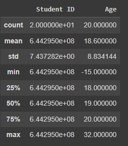

## ตัวอย่างการเตรียมข้อมูล (Students)

อ่านข้อมูลจากไฟล์ csv
```
df = pd.read_csv('ds_students.csv')
df
```

สำรวจข้อมูลเบื้องต้น เช่น ดูค่าสถิติเบื้องต้น และ ดูข้อมูลที่มีค่า null

```
df.describe()
```



คำสั่ง describe() จะแสดงค่าสถิติเบื้องต้นของข้อมูลที่เป็นตัวเลข และจะไม่แสดงค่าสถิติของข้อมูลที่ไม่ใช่ตัวเลข 

จะสังเกตุเห็นค่าต่ำสุดของ Age ที่มีค่าน้อยสุดที่ผิดปกติที่ -15 และ Score ที่เป็นตัวเลขแต่ไม่ถูกแสดงรายละเอียด ซึ่งอาจมีข้อผิดพลาดในข้อมูลที่ต้องตรวจสอบต่อ


```
df.info()
```


จะเห็นว่าในคำสั่ง info() จะแสดงรายละเอียด DataFrame เบื้องต้น เช่น จำนวนข้อมูล จำนวนคอลัมน์ ตลอดจนช่วง index ของแถวและคอลัมน์ และสิ่งสำคัญจะแสดงจำนวนข้อมูลที่ไม่ใช่ค่า null ของแต่ละคอลัมน์

จะเห็นว่า Score มีข้อมูลที่เป็น null อยู่ 1 ข้อมูล และข้อมูลยังแสดงเป็นชนิดของ object อยู่ ซึ่งจะต้องแปลงเป็นตัวเลขก่อน และ Grade ก็เช่นเดียวกันมีข้อมูล null อยู่ 2 ข้อมูล ซึ่งข้อมูล null เหล่านี้จะต้องถูกแก้ไขก่อนจะนำไปใช้งานได้

นอกจากนี้เราสามารถใช้คำสั่งในการสรุปข้อมูลที่เป็น null ได้ดังนี้

```
df.isnull().sum()
```


เมื่อสำรวจข้อมูลทั้งหมดแล้ว สิ่งที่ต้องแก้ไขมีดังนี้
* แก้ไขคำว่า 'ขาดสอบ' ใน Score เป็นคะแนน 0
```
df.loc[   df['Score']=='ขาดสอบ'   ,   'Score'  ] = 0
df
```

* แปลงชนิดข้อมูลของ Score จาก object เป็น float
```
df['Score'] = df['Score'].astype(float)
df.info()
```

* แก้ไขข้อมูลที่เป็น null ของ Score เป็น 0
```
df['Score'].fillna(0,inplace=True)
df
```

* แก้ไขข้อมูลที่เป็น null ของ Grade เป็น 'E'
```
df['Grade'].fillna('E',inplace=True)
df
```

* แก้ไขข้อมูลติดลบของ Age เป็นค่าเฉลี่ยของ Age ที่มีค่ามากกว่า 0
```
# หาค่าเฉลี่ยของ Age ที่มีค่ามากกว่า 0
mean_age=df.loc[   df['Age']>0   ,   'Age'  ].mean().astype(int)
mean_age
```

```
# แทนค่าติดลบด้วยค่าเฉลี่ยของ Age ที่มีค่ามากกว่า 0
df.loc[   df['Age']<=0   ,   'Age'  ]=mean_age
df
```


<ins>Note:</ins> ระหว่างใช้คำสั่งต่าง ๆ ในการแก้ไขข้อมูล ควรใช้คำสั่ง describe() และ info() เพื่อตรวจสอบผลการปรับปรุงข้อมูล


นอกจากนี้ข้อมูลซึ่งไม่มีผลต่อการวิเคราะห์ หรือข้อมูลที่ไม่จำเป็นต้องใช้งาน ควรทำการลบข้อมูลเหล่านี้ออกด้วย

การลบคอลัมน์ที่ไม่จำเป็นต้องใช้งาน สามารถทำได้โดยใช้ใช้คำสั่ง drop และกำหนดชื่อคอลัมน์ที่ต้องการลบ และกำหนด axis=1 และ inplace=True เช่น ตัวอย่างการลบคอลัมน์ Student ID และ Name ออกจาก DataFrame ดังนี้

```
df.drop(  ['Student ID', 'Name'] , axis=1 , inplace=True )
```


