# การจำแนกข้อมูล (Classification) โดยใช้ Scikit-learn (Part 1 - Decision Tree)

**Scikit-Learn** คือ Library ด้าน Machine Learning ที่เปิดให้ใช้งานได้ในภาษา Python ซึ่งมีเครื่องมือรองรับเทคนิคในการจำแนก (Classification) ที่หลากหลาย เช่น Decision Tree, Neural network และเทคนิคอื่น ๆ ตลอดจนจัดเตรียมข้อมูลในการทดสอบการทำงานไว้ให้พร้อมกันใน Library นี้

แหล่งข้อมูลเพิ่มเติม : https://scikit-learn.org/stable/index.html

## ขั้นตอนการสร้างโมเดล (Decision Tree) การจำแนกข้อมูลและทดสอบประสิทธิภาพ โดยข้อมูลจาก Scikit-Learn 

### การนำเข้า library
การใช้งาน Scikit-Leaning เริ่มต้นจากการ import library เพื่อเรียกใช้งาน

```python
import sklearn
```

เราสามารถเรียกใช้ข้อมูลที่มีอยู่ใน Scikit-Learn ได้โดยการ import ข้อมูลที่ต้องการเข้ามาในโปรแกรม โดยใช้คำสั่ง


### การนำเข้าข้อมูล

```python
from sklearn import datasets
```

โดยเรียกใช้ข้อมูล iris ด้วยคำสั่ง datasets.load_iris() และ หากต้องการทราบรายละเอียดของข้อมูล iris สามารถใช้คำสั่ง iris.DESCR ได้

```python
iris = datasets.load_iris()
print(iris.DESCR)
```

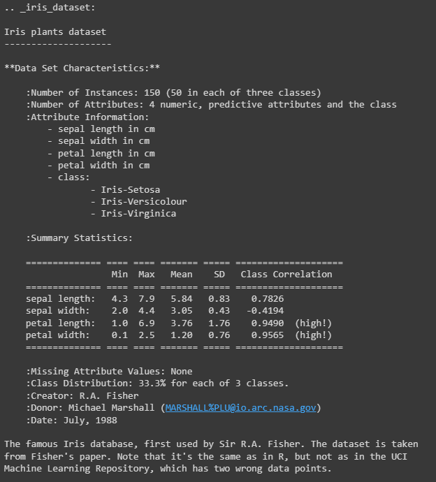


### การสร้าง classifier 

การจำแนกข้อมูลเราจะต้องทำการสร้าง classifier ขึ้นมาก่อน ตัวอย่างการสร้าง classifier ด้วย Decision Tree และการใช้งาน classifier ในการจำแนกข้อมูลด้วย Decision Tree ดังนี้

```python
from sklearn import tree
clf = tree.DecisionTreeClassifier()
```

### การใช้งาน train model
เมื่อสร้าง classifier ขึ้นมาแล้ว เราจะต้องทำการ train โมเดลก่อน โดยใช้คำสั่ง clf.fit(X, y)
โดยในตัวอย่างนี้เราจะเรียกใข้ข้อมูล iris ในการ train โมเดล 

```python
from sklearn import datasets
from sklearn import tree
iris = datasets.load_iris()
clf = tree.DecisionTreeClassifier()
clf.fit(iris.data, iris.target)
```

### การแบ่งข้อมูล train และ test

แต่ทั้งนี้ในการใช้ข้อมูลทั้งหมดเพื่อ train โมเดลจะทำให้เราไม่ได้สามารถทดสอบประสิทธิภาพของโมเดลที่ได้มาได้ ดังนั้นเราจึงจะทำการแบ่งข้อมูลออกเป็น 2 ส่วน คือ 
1) ข้อมูลสำหรับการสร้างโมเดล (train)  
2) ข้อมูลสำหรับทดสอบประสิทธิภาพของโมเดล (test) 
โดยใช้คำสั่ง train_test_split ในการแบ่งข้อมูล

ในตัวอย่างข้างล่างจะแบ่งข้อมูลเป็น 70% สำหรับสร้างโมเดล (train) และ 30% สำหรับทดสอบโมเดล (test) โดยการแบ่งข้อมูลจะเป็นแบบสุ่ม 

โดยทั่วไปสัดส่วนในการแบ่งข้อมูลจะต้องกำหนดให้ส่วน train มากกว่าส่วน test เสมอ สัดส่วนที่นิยมใช้กันคือ 60:40 70:30 หรือ 80:20

ในการสร้างโมเดลและไปจนถึงการทดสอบโมเดล ข้อมูลจะถูกแยกสิ่งที่สนใจจะจำแนกหรือทำนายออกจากข้อมูลที่เป็นคุณสมบัติ (attribute) ก่อน จึงจะได้ว่า
* <ins>**ข้อมูลที่เป็นคุณสมบัติ (attribute) ของกล้วยไม้**</ins> ซึ่งมี 4 คุณสมบัติ คือ ความยาวและความกว้างของกลีบดอก (petal) และความยาวและความกว้างของกลีบเลี้ยง (sepal) โดยส่วนนี้จะก็บไว้ในตัวแปร **X_train** และ **X_test** สำหรับข้อมูลที่ใช้สร้างโมเดล (train) และข้อมูลที่ใช้ในการทดสอบ (test)  ตามลำดับ
* <ins>**ข้อมูลสิ่งที่สนใจจำแนกหรือทำนาย (class)**</ins> ซึ่งก็คือ พันธุ์ของกล้วยไม้ ซึ่งมี 3 พันธุ์ คือ พันธุ์ Iris-Setosa, Iris-Versicolour และ Iris-Virginica โดยส่วนที่จะแยกเก็บไว้ในตัวแปร **y_train** และ **y_test** สำหรับข้อมูลที่ใช้สร้างโมเดล (train) และข้อมูลที่ใช้ในการทดสอบ (test) ตามลำดับ 

  โดยข้อมูลส่วนนี้เป็นตัวเลข 0, 1 และ 2 แทนพันธุ์ของกล้วยไม้ Iris-Setosa, Iris-Versicolour และ Iris-Virginica ตามลำดับ


### ตัวอย่างโค้ดการแบ่งข้อมูลและ train model

```python
from sklearn import datasets
from sklearn import tree
from sklearn.model_selection import train_test_split

#โหลดข้อมูล iris
iris = datasets.load_iris()

#แบ่งข้อมูลเป็น 70% สำหรับ train และ 30% สำหรับ test
X_train, X_test, y_train, y_test = train_test_split(iris.data, iris.target, test_size=0.3, stratify=y)

#สร้างโมเดล
clf = tree.DecisionTreeClassifier()
#train โมเดล
clf.fit(X_train, y_train)

#train  โดย map  ค่า 0,1 และ 2 กับชื่อพันธุ์กล้วยไม้
#clf.fit(X_train, iris.target_names[y_train] )
```

Decision Tree สามารถกำหนด Parameter ในการ train ได้ เช่น
* criterion คือการคำนวณตัววัดที่ใช้ในการแบ่งข้อมูล หรือเรียกว่า impurity measures โดยค่าเริ่มต้นจะกำหนดเป็น gini
* max_depth กำหนดความลึกของต้นไม้ที่ได้ หากเกินระดับที่กำหนดจะหยุดการแบ่งข้อมูล
* min_samples_split จำนวนข้อมูลขั้นต่ำใน internal node ที่ต้องทำการแบ่งข้อมูลต่อ หากข้อมูลไม่เพียงพอจะหยุดการแบ่งข้อมูล 
* min_samples_leaf จำนวนข้อมูลขั้นต่ำในแต่ละ Leaf Node 

เช่น หากต้องการกำหนดความลึกของต้นไม้ไม่ให้เกิน 5 ระดับ สามารถกำหนดได้ในตอนสร้างโมเดลดังนี้

```python
clf = tree.DecisionTreeClassifier(max_depth=5)
```

รายละเอียดเพิ่มเติมศึกษาได้จาก [scikit-learn](https://scikit-learn.org/stable/modules/generated/sklearn.tree.DecisionTreeClassifier.html#sklearn.tree.DecisionTreeClassifier)


### การทำนายข้อมูลจากโมเดล

เมื่อเราได้โมเดลแล้ว ต่อไปเมื่อมีข้อมูลที่เกิดขึ้นมาใหม่ เราสามารถใช้โมเดลนี้ในการจำแนกหรือทำนายข้อมูลนั้นได้ โดยในตัวอย่างนี้เราจะใช้ข้อมูลส่วน test ที่แบ่งไว้เพื่อทำการทดสอบโมเดลหรือแทนข้อมูลที่จะเกิดในอนาคต (เพราะข้อมูลเหล่านี้ โมเดลไม่เคยเห็นมาก่อน เนื่องจากไม่ได้ถูกใช้ในการสร้างโมเดล)

ในการจำแนกข้อมูลหรือการทำนายจะช้คำสั่ง clf.predict(X) ซึ่งจะคืนค่าเป็นผลลัพธ์ที่ได้จากการจำแนกข้อมูล โดยหากเราต้องการทำนายข้อมูลที่มีอยู่ใน X_test ให้ใช้คำสั่งดังนี้

```python
clf.predict(X_test)
```


ค่าที่ได้คือ Array ของผลการทำนายของโมเดล Decision Tree โดยแทนค่าของ Class ที่ทำนาย หรือในที่นี้คือพันธุ์ของกล้วยไม้ดังนี้

* 0 แทนพันธุ์ Iris-Setosa
* 1 แทนพันธุ์ Iris-Versicolour
* 2 แทนพันธุ์ Iris-Virginica

จากผลลัพธ์ดังนี้

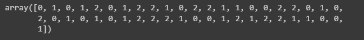

หมายความว่า 
* ข้อมูลใน X_test ที่อยู่ใน index 0 มีค่าเป็น 0 ถูกทำนายว่าเป็นพันธุ์ Iris-Setosa 
* ข้อมูลใน X_test ที่อยู่ใน index 1 มีค่าเป็น 1 ถูกทำนายว่าเป็นพันธุ์ Iris-Versicolour 
* ข้อมูลใน X_test ที่อยู่ใน index 2 มีค่าเป็น 0 ถูกทำนายว่าเป็นพันธุ์ Iris-Setosa และอื่น ๆ ตามลำดับ
* ข้อมูลใน X_test ที่อยู่ใน index 3 มีค่าเป็น 1 ถูกทำนายว่าเป็นพันธุ์ Iris-Versicolour 
* ข้อมูลใน X_test ที่อยู่ใน index 4 มีค่าเป็น 2 ถูกทำนายว่าเป็นพันธุ์ Iris-Virginica
* และข้อมูลใน index อื่น ๆ ที่เหลือก็เช่นเดียวกัน

เพื่อให้เห็นรายละเอียดชัดเจนขึ้น จึงใช้โค้ดข้างล่างนี้เพื่อรวมข้อมมูลและแสดงในรูปแบบ DataFrame พร้อม map ค่า 0,1 และ 2 กับชื่อพันธุ์กล้วยไม้ ดังตัวอย่างโค้ดด้านล่าง

```python
import pandas as pd

# Convert iris to pandas dataframe
df = pd.DataFrame(data=X_test, columns=iris.feature_names)

# Add target column to dataframe
df['class'] = y_test
df['predited_class'] =clf.predict(X_test)

# Map target values to target names
target_names = dict(enumerate(iris.target_names))
df['class'] = df['class'].map(target_names)
df['predited_class'] = df['predited_class'].map(target_names)

# Print dataframe
df[:10]
```

ผลลัพธ์ที่ได้คือ

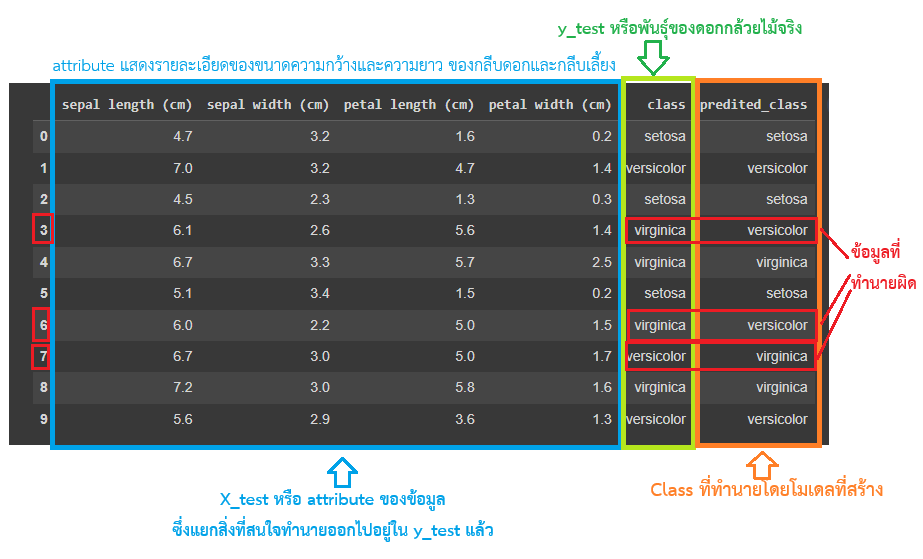

จะเห็นว่าข้อมูลใน index ที่  3, 6 และ 7 จำแนก(ทำนาย)พันธุูกล้วยไม้โดยใช้โมเดลที่สร้าง ไม่ตรงกับพันธุ์กล้วยไม้จริง ซึ่งแสดงให้เห็นว่าในข้อมูลเหล่านี้เกิดการจำแนกผิดพลาดนั้นเอง 

สำหรับข้อมูลที่ให้ผลการจำแนกตรงกับพันธุ์กล้วยไม้จริง นั้นคือโมเดลสามารถจำแนกได้ถูกต้องนั้นเอง

นอกจากนี้หากต้องการทำนายเพียงข้อมูลแรกของ X_test ให้ใช้คำสั่งดังนี้ (เนื่องจากคำสั่ง predict ต้องการข้อมูล 2 มิติ แต่ข้อมูลที่เรามีมีมิติเป็น 1 มิติ จึงต้องทำการ reshape ให้เป็น 2 มิติก่อน)

```python
clf.predict(X_test[0].reshape(1, -1))[0]
```


### การแสดงโมเดล Decision Tree

หากต้องการแสดงโมเดล Decision Tree ในรูปแบบของกราฟ สามารถใช้คำสั่งดังนี้

```python
import matplotlib.pyplot as plt

# Plot the decision tree
plt.figure(figsize=(20,10))
tree.plot_tree(clf, filled=True, feature_names=iris.feature_names, class_names=iris.target_names)
plt.show()
```

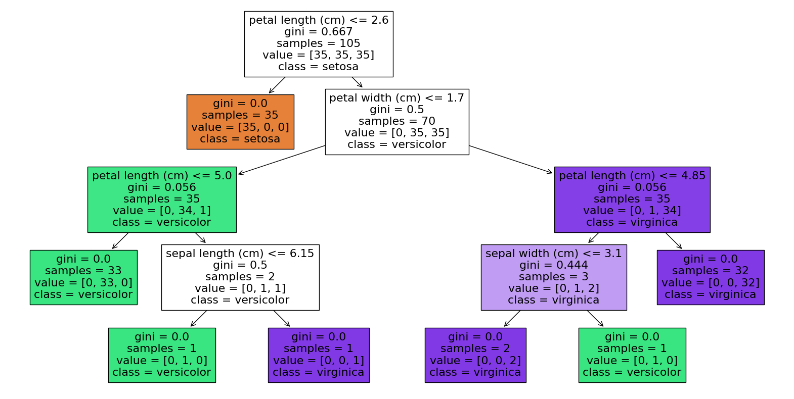

และสามารถ export กราฟเป็นไฟล์ PDF หรือรูปภาพได้ดังนี้

```python
from sklearn.tree import export_graphviz
import graphviz

# Export decision tree to graphviz format
dot_data = export_graphviz(clf, out_file=None, 
                           feature_names=iris.feature_names,  
                           class_names=iris.target_names,  
                           filled=True, rounded=True,  
                           special_characters=True)

# Visualize decision tree using graphviz
graph = graphviz.Source(dot_data)
graph.format = 'png' 
graph.render("iris_decision_tree")
graph # Display decision tree
```

โดยหากระบุค่า graph.format เป็น 'pdf' จะได้ไฟล์ PDF แทน และหากระบุค่า graph.format เป็น 'png' จะได้ไฟล์รูปภาพแทน


### การประเมินประสิทธิภาพของโมเดล

เมื่อ train โมเดลเสร็จแล้ว เราจะทำการทดสอบประสิทธิภาพของโมเดลที่ได้ โดยใช้คำสั่งดังต่อไปนี้

**แสดงรายละเอียดการประเมินประสิทธิภาพของโมเดล**

```python
from sklearn import metrics
print(metrics.classification_report(y_test, clf.predict(X_test)))
```

ผลลัพธ์ที่ได้คือ

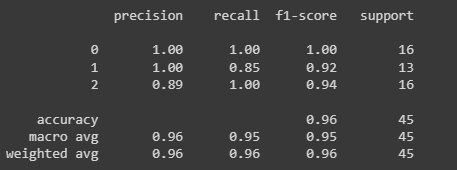

ซึ่งจะเห็นว่าผลที่ได้จะแสดงค่า precision, recall, f1-score และค่า support ของผลการทำนายของโมเดล โดยที่
* precision คือ ค่าความแม่นยำของการทำนาย หรือค่า True Positive / (True Positive + False Positive)
* recall คือ ค่าความถูกต้องของการทำนาย หรือค่า True Positive / (True Positive + False Negative)
* f1-score คือ ค่าเฉลี่ยความถูกต้องของการทำนาย หรือค่า 2 * (precision * recall) / (precision + recall)
* support คือ จำนวนข้อมูลที่ใช้ในการทำนาย

**แสดง Confusion Matrix ของโมเดล**

```python
metrics.confusion_matrix(y_test, clf.predict(X_test))
```

ผลลัพธ์ที่ได้คือ

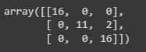

ตาราง Confusion Matrix โดยเมื่อดูตามแถวจะแทนคลาสของข้อมูลจริง และดูตามคอลัมน์จะแทนคลาสของข้อมูลที่ทำนายได้ 

ตำแหน่งที่อยู่ในแนวทแยงมุมจะแสดงค่าที่ทำนายถูกต้องของแต่ละคลาส (True) ซึ่งในตัวอย่างนี้คือ 16, 11 และ 16 แสดงผลการจำแนกถูกต้องของกล้วยไม้พันธุ์ Iris-Setosa (0), Iris-Versicolour (1) และ Iris-Virginica (2) ตามลำดับ  

ส่วนตำแหน่งที่ไม่อยู่ในแนวทแยงมุมจะแสดงค่าที่ทำนายผิดพลาด (False) ซึ่งในข้อมูลที่นำมาทดสอบนี้มีค่าที่ทำนายผิดพลาด 2 รายการ แสดงในแถวที่ 2 คอลัมน์ที่ 3 ซึ่งในแถวที่ 2 (index 1) นี้หมายถึงข้อมูลจริงระบุว่าเป็นกล้วยไม้พันธุ์ Iris-Versicolour คอลัมน์ที่ 3 (index 2) แต่ถูกจำแนกโดยโมเดลให้เป็นกล้วยไม้พันธุ์ Iris-Virginica ซึ่งเป็นการจำแนกผิดนั้นเอง


**แสดงค่าความถูกต้องของโมเดล**

```python
clf.score(X_test, y_test)
```

ผลลัพธ์ที่ได้คือ 0.9555555555555556 หรือ 95.56% ซึ่งแสดงค่าความถูกต้องของโมเดลที่ได้มา หากพิจารณาจากตาราง Confusion Matrix จะเห็นว่าโมเดลทำนายผิด 2 รายการจากทั้งหมด 45 รายการ ซึ่งตรงกับ 95.56% ที่ได้จากคำสั่ง clf.score(X_test, y_test) ดังนั้นค่าความถูกต้องของโมเดลที่ได้มานั้นคือ 95.56%

โดยรายละเอียดในการประเมินประสิทธิภาพของโมเดลจะอธิบายในเนื้อหาต่อไปสำหรับหัวข้อการประเมินประสิทธิภาพอย่างละเอียดอีกครั้ง


### เพิ่มเติม : การแสดงdecision surface ของ Decision Tree

เราสามารถแสดง decision boundary ของ decision tree โดยการแสดงจากคู่ของ attribute ที่สนใจ โดยใช้คำสั่ง DecisionBoundaryDisplay.from_estimator ดังตัวอย่างโค้ดด้านล่าง

อ้างอิงตัวอย่าง : [scikit-learn](https://scikit-learn.org/stable/auto_examples/tree/plot_iris_dtc.html#sphx-glr-auto-examples-tree-plot-iris-dtc-py)

```python
import matplotlib.pyplot as plt
import numpy as np

from sklearn.datasets import load_iris
from sklearn.inspection import DecisionBoundaryDisplay
from sklearn.tree import DecisionTreeClassifier

# Parameters
n_classes = 3
plot_colors = "ryb"
plot_step = 0.02


for pairidx, pair in enumerate([[0, 1], [0, 2], [0, 3], [1, 2], [1, 3], [2, 3]]):
    # We only take the two corresponding features
    X = iris.data[:, pair]
    y = iris.target

    # Train
    clf = DecisionTreeClassifier().fit(X, y)

    # Plot the decision boundary
    ax = plt.subplot(2, 3, pairidx + 1)
    plt.tight_layout(h_pad=0.5, w_pad=0.5, pad=2.5)
    DecisionBoundaryDisplay.from_estimator(
        clf,
        X,
        cmap=plt.cm.RdYlBu,
        response_method="predict",
        ax=ax,
        xlabel=iris.feature_names[pair[0]],
        ylabel=iris.feature_names[pair[1]],
    )

    # Plot the training points
    for i, color in zip(range(n_classes), plot_colors):
        idx = np.where(y == i)
        plt.scatter(
            X[idx, 0],
            X[idx, 1],
            c=color,
            label=iris.target_names[i],
            cmap=plt.cm.RdYlBu,
            edgecolor="black",
            s=15,
        )

plt.suptitle("Decision surface of decision trees trained on pairs of features")
plt.legend(loc="lower right", borderpad=0, handletextpad=0)
_ = plt.axis("tight")
```

ผลลัพธ์ที่ได้คือ

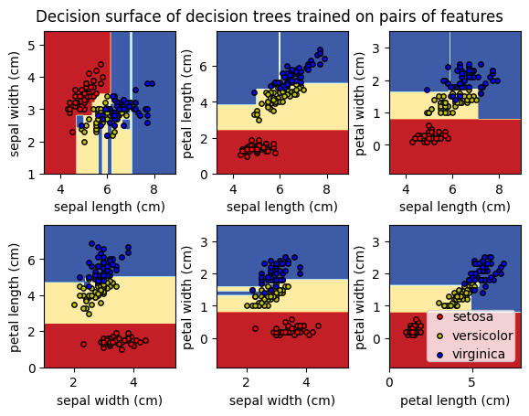

จะเห็นว่าจะได้ผลการ estimate การแบ่งข้อมูลโดยแสดงในรูปแบบ 2 มิติ โดยใช้คู่ของ attribute นำมาแสดงผล


## ขั้นตอนการสร้างโมเดล (Decision Tree) การจำแนกข้อมูลและทดสอบประสิทธิภาพ โดยข้อมูลจาก CSV File
อ้างอิงส่วนการเตรียมข้อมูล : [Decision Tree Tutorial - Kaggle](https://www.kaggle.com/code/enespolat/decision-tree-tutorial/notebook)

### 1) โหลดข้อมูลจาก CSV File

```python
import pandas as pd

df_cancer= pd.read_csv('breastCancer.csv')
df_cancer.head()
```

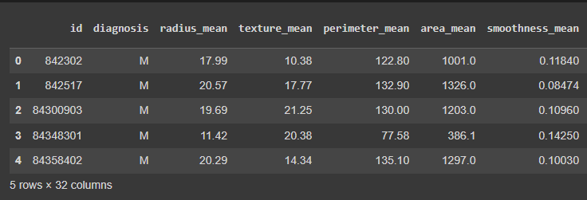

### 2) ตรวจสอบข้อมูล

โดยใช้คำสั่งเบื้องต้นในการสำรวจต่าง ๆ ดังนี้

```python
df_cancer.columns
```

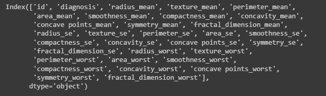


```python
df_cancer.describe()
```

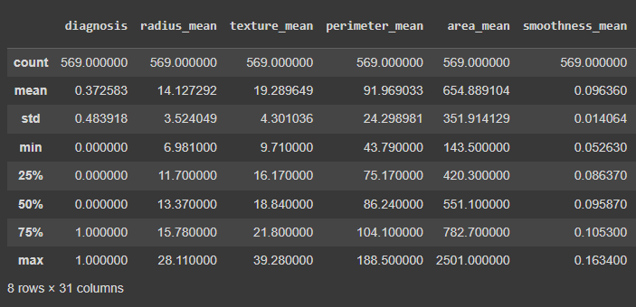


```python
df_cancer.info()
```

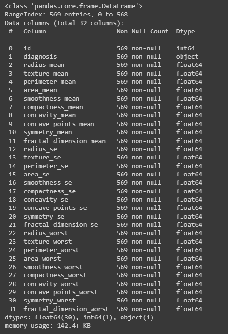


### 3) เตรียมข้อมูล

ลบคอลัมน์ id ซึ่งไม่จำเป็นต่อการวิเคราะห์ออกไป

```python
df_cancer.drop(["id"],axis=1,inplace=True)
df_cancer.columns
```

สิ่งที่เราสนใจคือการทำนายการเกิดมะเร็ง ดังนั้น class หรือ target ของเราคือ dianosis ซึ่งจะแสดงค่าเป็น 'M' และ 'B' ซึ่งย่อมาจาก 'Malignant' และ 'Benign' ตามลำดับ ดังนั้นเราจะทำการแปลงค่าให้เป็น 1 และ 0 ดังโค้ดด้านล่าง

```python
df_cancer.diagnosis=[1 if each == "M" else 0 for each in df_cancer.diagnosis]
df_cancer.head()
```

จะได้ข้อมูลหลังจากแปลงค่าแล้วดังนี้

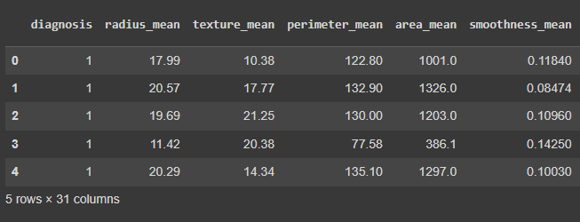

แยกข้อมูล attribute และ class ออกจากกัน โดยเก็บไว้ในตัวแปร x และ y ตามลำดับ

```python
y=df_cancer.diagnosis.values
x=df_cancer.drop(["diagnosis"], axis=1)
```

### 4) ทำการ train โมเดล

โดยมีการะแบ่งข้อมูลเป็น 70% สำหรับสร้างโมเดล (train) และ 30% สำหรับทดสอบโมเดล (test) ทั้งใน attribute และ class ดังนี้

```python
from sklearn import tree
from sklearn.model_selection import train_test_split
X_train, X_test, y_train, y_test = train_test_split(x, y, test_size=0.3 ,stratify=y)
clf_cancer = tree.DecisionTreeClassifier()
clf_cancer.fit(X_train, y_train )
```

### 5) แสดงภาพโมเดล Decision Tree 

```python
import matplotlib.pyplot as plt

# Plot the decision tree
plt.figure(figsize=(20,10))
tree.plot_tree(clf_cancer, filled=True, feature_names=x.columns, class_names=['Benign','Malignant'])
plt.show()
```
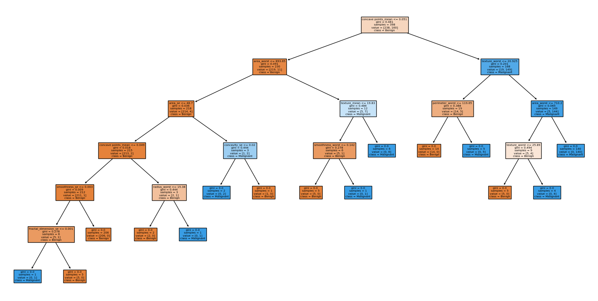

### 6) แสดผลการทำนาย

จัดข้อมูลเพื่อให้เห็นข้อมูล คลาสจริง และผลการทำนาย พร้อมกันใน DataFrame ได้ดังนี้

```python
import pandas as pd

# Copy X_test dataframe
df_cancer_predict = X_test.copy()

# Add target column to dataframe
df_cancer_predict['predited_class'] =clf_cancer.predict(X_test)
df_cancer_predict['class'] = y_test

# Map target values to target names
target_names = dict(enumerate(['Benign','Malignant']))
df_cancer_predict['class'] = df_cancer_predict['class'].map(target_names)
df_cancer_predict['predited_class'] = df_cancer_predict['predited_class'].map(target_names)

# Print dataframe
df_cancer_predict[:10]
```

จากภาพด้านล่าง จะเห็นว่าในแถวที่ 8 แสดงให้เห็นการทำนายผิดอยู่

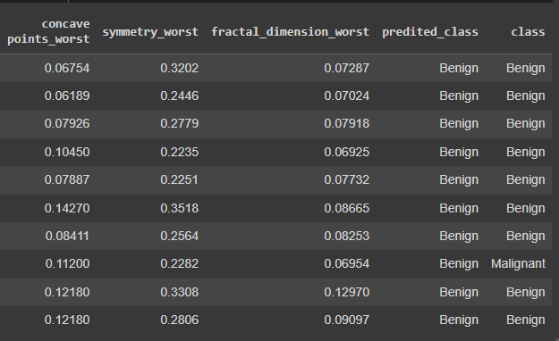

### 7) ประเมินประสิทธิภาพของโมเดล  

แสดงรายงานการประเมินประสิทธิภาพ

```python
from sklearn import metrics
print(metrics.classification_report(y_test, clf_cancer.predict(X_test)))
```
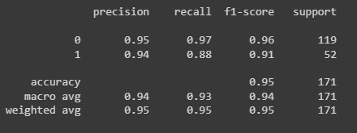

แสดง Confusion Matrix

```python
metrics.confusion_matrix(y_test, clf_cancer.predict(X_test))
```

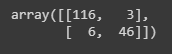

แสดงค่าความถูกต้อง

```python
clf_cancer.score(X_test, y_test)
```
จากตัวอย่างนี้จะได้ค่าความถูกต้องอยู่ที่ 0.9473684210526315 หรือประมาณ 94.74% นั้นเอง

## แบบฝึกหัด

ให้นักศึกษาทำการสร้างโมเดล Decision Tree จากข้อมูล [Titanic](Datasets/titanic.csv) 

ข้อมูล Titanic มีรายละเอียดดังนี้

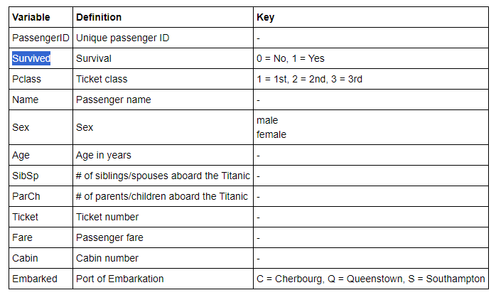

อ้างอิงภาพ : [Analysis of Titanic Survival Data](https://ttsteiger.github.io/projects/titanic_report.html)

กำหนดให้นักศึกษาทำตามขั้นตอนต่อไปนี้เท่านั้น ลงใน Google Colab โดยแสดงโค้ดการทำงานตามขั้นตอนที่กำหนด พร้อมแสดงให้เห็นผลลัพธ์ที่ได้ที่เกิดจากการทำงานในแต่ละขั้นตอนไปด้วย

1) เลือกข้อมูลที่ใช้คือ 'Survived', 'Pclass', 'Sex', 'Age', 'SibSp' และ 'Embarked' โดยให้ลบข้อมูลอย่างอื่นทิ้ง
2)  แปลงข้อมูล Sex โดยให้ค่า male เป็น 0 และ femal เป็น 1
3)  ในคอลัมน์ Embarked เดิมจะมีค่าเป็นอักษร คือ C = Cherbourg, Q = Queenstown และ S = Southampton ให้แปลงโดย กำหนดให้ C = 0, Q = 1 และ S = 2 โดยข้อมูลที่เป็น null หรือ na จะคงไปเช่นเดิมก่อนในขั้นตอนนี้
4) ในคอลัมน์ Age ให้แทนค่า null หรือ na ด้วยค่าเฉลี่ยของข้อมูลที่มีอยู่
5) ในคอลัมน์ Embarked ลบแถวของข้อมูลที่เป็น null หรือ na ออกไป (หากถูกต้องจะคงเหลือจำนวนแถวข้อมูล 889 แถว)
6) ทำการ train โมเดล Decision Tree 
7) แสดงภาพโมเดล Decision Tree ([ตัวอย่างโมเดลที่ได้](images/06_18_Example_Result_Titanic.pdf))
8) แสดงผลการทำนาย
9) ประเมินประสิทธิภาพของโมเดล
