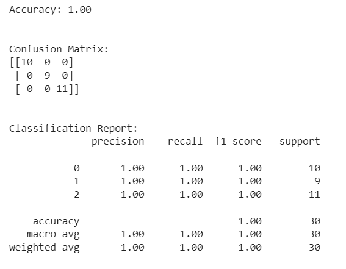
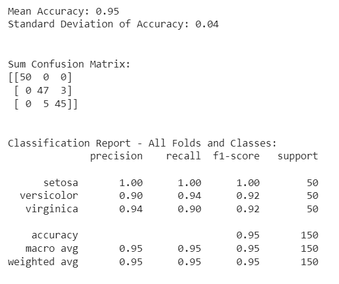

# การประเมินประสิทธิภาพโมเดล

เมื่อสามารถสร้างโมเดลได้แล้ว สิ่งที่สำคัญคือการวัดประสิทธิภาพเพื่อดูว่าโมเดลที่ได้มามีประสิทธิภาพดีเพียงใดและสามารถนำไปใช้งานได้หรือไม่ โดยตัวอย่างต่อไปนี้จะแสดงรูปแบบการวัดประสิทธิภาพ 2 แบบ คือ วิธีการ Train/Test split และ Cross Validation
## ตัวอย่างการประเมินประสิทธิภาพโดยใช้ Train/Test split

```python
# Import necessary libraries
from sklearn.datasets import load_iris
from sklearn.model_selection import train_test_split
from sklearn.tree import DecisionTreeClassifier
from sklearn.metrics import accuracy_score, classification_report, confusion_matrix

# Load the Iris dataset as an example
data = load_iris()
X = data.data
y = data.target

# Split the data into training and testing sets
X_train, X_test, y_train, y_test = train_test_split(X, y, test_size=0.2, random_state=42)

# Create a decision tree classifier
clf = DecisionTreeClassifier(random_state=42)

# Fit the model to the training data
clf.fit(X_train, y_train)

# Make predictions on the test data
y_pred = clf.predict(X_test)

# Evaluate the model
accuracy = accuracy_score(y_test, y_pred)
conf_matrix = confusion_matrix(y_test, y_pred)
class_report = classification_report(y_test, y_pred)

# Print the evaluation results
print(f"Accuracy: {accuracy:.2f}")
print("Confusion Matrix:")
print(conf_matrix)
print("Classification Report:")
print(class_report)
```



## ตัวอย่างการประเมินประสิทธิภาพโดยใช้ Cross Validation
ในตัวอย่างนี้ จะนำผลลัพธ์ที่ได้ของแต่ละ Fold นำมาคิดค่าเฉลี่ยและค่าเบี่ยงเบนของค่า Accuracy  Precision Recall และ F1-Score ที่ได้จากการทำ Cross Validation ทั้งหมด
โดย Confusion Matrix จะแสดงจากผลรวมของทุก Fold

```python
# Import necessary libraries
from sklearn.datasets import load_iris
from sklearn.model_selection import StratifiedKFold
from sklearn.tree import DecisionTreeClassifier
from sklearn.metrics import accuracy_score, classification_report, confusion_matrix
import numpy as np

# Load the Iris dataset as an example
data = load_iris()
X = data.data
y = data.target


# Define the number of splits (k) for cross-validation
k = 4  # You can change this value to the desired number of folds

# Initialize Stratified KFold cross-validation
kf = StratifiedKFold(n_splits=k, shuffle=True, random_state=42)

# Initialize empty lists to store predictions and ground truth for all folds
all_y_true = []
all_y_pred = []
accuracy_scores=[]
confusion_matrices=[]

# Loop through each fold
for train_index, test_index in kf.split(X,y):
    X_train, X_test = X[train_index], X[test_index]
    y_train, y_test = y[train_index], y[test_index]

    # Create a decision tree classifier
    clf = DecisionTreeClassifier(random_state=42)

    # Fit the model to the training data
    clf.fit(X_train, y_train)

    # Make predictions on the test data
    y_pred = clf.predict(X_test)

    # Calculate accuracy for this fold and store it
    accuracy = accuracy_score(y_test, y_pred)
    accuracy_scores.append(accuracy)

    # Calculate confusion matrix and store it
    confusion = confusion_matrix(y_test, y_pred)
    confusion_matrices.append(confusion)

    # Store ground truth and predictions for this fold
    all_y_true.extend(y_test)
    all_y_pred.extend(y_pred)


# Calculate mean and standard deviation of accuracy scores
mean_accuracy = np.mean(accuracy_scores)
std_accuracy = np.std(accuracy_scores)

# Print evaluation metrics summary
print(f"Mean Accuracy: {mean_accuracy:.2f}")
print(f"Standard Deviation of Accuracy: {std_accuracy:.2f}")

# Print average confusion matrix (you can also compute other statistics from it)
sum_confusion_matrix = np.sum(confusion_matrices, axis=0)
print("\n\nSum Confusion Matrix:")
print(sum_confusion_matrix)


# Generate a classification report for all folds and classes
report = classification_report(all_y_true, all_y_pred, target_names=data.target_names)

# Display the classification report
print("\n\nClassification Report - All Folds and Classes:")
print(report)

```




## แบบฝึกหัด

ให้นักศึกษาทำการเปรียบเทียบประสิทธิภาพของโมเดล 3 โมเดล คือ  Decision Tree, Naïve Bayes และ k-Nearest Neighbors (ให้กำหนด k ต่าง ๆ กัน 3 ค่า) โดยใช้วิธีการ Train-Test กำหนดให้แบ่งข้อมูล (75:25) และใช้ข้อมูล [Titanic](Datasets/titanic.csv) โดยทำการเตรียมข้อมูลและศึกษาวิธีการสร้างโมเดลในเนื้อหาก่อนหน้านี้ได้

<sup><ins>หมายเหตุ</ins> โค้ดและข้อความบางส่วนมีการใช้ Github Copilot ในการเขียน และปรับแก้บ้างส่วนเพื่อให้เหมาะสมกับเนื้อหา จึงอาจมีเนื้อหาจากแหล่งข้อมูลอื่นๆ ที่ไม่ได้ระบุมาในเอกสารนี้</sup>
