# การแบ่งกลุ่ม (Clustering) โดยใช้ K-means (Python)

K-means จัดเป็นเทคนิคของ Machine learning ในกลุ่ม Unsupervised learning ซึ่งเมื่่อเปรียบเทียบกับเทคนิคในกลุ่มของการจำแนก (Classification) จะเห็นว่าการทำงานของ Classification อาศัยข้อมูลที่มีการระบุ Class หรือเรียกว่า Labelled data ในการสร้างโมเดล แต่ในทางกลับกัน Unsupervised learning จะไม่มีการระบุ Class ใด ๆ ในข้อมูล แต่จะใช้ข้อมูลที่มีคุณลักษณะเด่นที่เป็นตัวแบ่งกลุ่ม (Cluster) ของข้อมูล ซึ่งจะเป็นการจัดกลุ่มข้อมูลที่มีคุณลักษณะคล้ายกันเข้าด้วยกัน โดยที่ไม่ได้ระบุว่าแต่ละกลุ่มนั้นคืออะไร หรือเรียกว่า Unlabelled data 

หลักการสำคัญของการแบ่งกลุ่มมีเพียงสองประเด็นหลัก ๆ คือ ข้อมูลที่อยู่ในกลุ่มเดียวกันต้องเหมือนกันมากที่สุด และข้อมูลที่อยู่ในกลุ่มต่าง ๆ ต้องแตกต่างกันมากที่สุด การแบ่งกลุ่มข้อมูลที่มีคุณลักษณะคล้ายกันเข้าด้วยกัน จะทำให้เราสามารถนำข้อมูลที่อยู่ในกลุ่มเดียวกันมาวิเคราะห์ หรือนำไปใช้งานได้ง่ายขึ้น เช่น การจัดกลุ่มลูกค้าที่มีความชอบในสินค้าเดียวกัน หรือการจัดกลุ่มลูกค้าที่มีความเหมือนกันเข้าด้วยกัน  หรือเรียกว่า Customer Segmentation หรือ Market Segmentation นอกจากนี้ยังมีตัวอย่างการใช้งานในเรื่องอื่น ๆ เช่น การจัดกลุ่มข่าวที่มีเนื้อหาคล้ายกันเข้าด้วยกัน หรือการจัดกลุ่มคำถามที่มีความหมายคล้ายกันเข้าด้วยกัน เป็นต้น

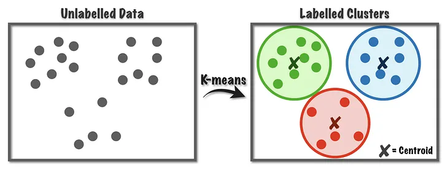

<sup>อ้างอิงภาพ https://kongruksiam.medium.com/สรุป-machine-learning-ep-7-การจัดกลุ่มด้วย-k-means-k-means-clustering-2423389f6c10</sup>


## การใช้ K-means ใน Python

ในการทำงานจะใช้ library ของ scikit-learn ในการทำ K-means โดยมีตัวอย่างการทำงานดังนี้

```python
from sklearn.cluster import KMeans
import numpy as np
X = np.array([[1, 2], [1, 4], [1, 0],[10, 2], [10, 4], [10, 0]])

# สร้างโมเดล K-means โดยกำหนดให้มีการแบ่งกลุ่มเป็น 2 กลุ่ม
kmeans = KMeans(n_clusters=2, random_state=0, n_init="auto").fit(X)
kmeans.labels_
kmeans.predict([[0, 0], [12, 3]])
kmeans.cluster_centers_
```

<sup>อ้างอิงโค้ด https://scikit-learn.org/stable/modules/generated/sklearn.cluster.KMeans.html</sup>

ผลลัพธ์ที่ได้จะแสดงถึง centroid ของแต่ละกลุ่ม โดยในตัวอย่างนี้กำหนดให้มีมีการแบ่งกลุ่มข้อมูลเป็น 2 กลุ่ม จากการกำหนด n_clusters=2


### ตัวอย่างการใช้งาน K-means ในการจัดกลุ่มข้อมูล (Iris Dataset)
อีกหนึ่งตัวอย่างการใช้ K-means กับข้อมูล iris dataset ดังนี้
    
```python
# Code source: Gaël Varoquaux
# Modified for documentation by Jaques Grobler
# License: BSD 3 clause

import matplotlib.pyplot as plt

# Though the following import is not directly being used, it is required
# for 3D projection to work with matplotlib < 3.2
import mpl_toolkits.mplot3d  # noqa: F401
import numpy as np

from sklearn import datasets
from sklearn.cluster import KMeans

np.random.seed(5)

iris = datasets.load_iris()
X = iris.data
y = iris.target

estimators = [
    ("k_means_iris_8", KMeans(n_clusters=8, n_init="auto")),
    ("k_means_iris_3", KMeans(n_clusters=3, n_init="auto")),
    ("k_means_iris_bad_init", KMeans(n_clusters=3, n_init=1, init="random")),
]

fig = plt.figure(figsize=(10, 8))
titles = ["8 clusters", "3 clusters", "3 clusters, bad initialization"]
for idx, ((name, est), title) in enumerate(zip(estimators, titles)):
    ax = fig.add_subplot(2, 2, idx + 1, projection="3d", elev=48, azim=134)
    est.fit(X)
    labels = est.labels_

    ax.scatter(X[:, 3], X[:, 0], X[:, 2], c=labels.astype(float), edgecolor="k")

    ax.xaxis.set_ticklabels([])
    ax.yaxis.set_ticklabels([])
    ax.zaxis.set_ticklabels([])
    ax.set_xlabel("Petal width")
    ax.set_ylabel("Sepal length")
    ax.set_zlabel("Petal length")
    ax.set_title(title)

# Plot the ground truth
ax = fig.add_subplot(2, 2, 4, projection="3d", elev=48, azim=134)

for name, label in [("Setosa", 0), ("Versicolour", 1), ("Virginica", 2)]:
    ax.text3D(
        X[y == label, 3].mean(),
        X[y == label, 0].mean(),
        X[y == label, 2].mean() + 2,
        name,
        horizontalalignment="center",
        bbox=dict(alpha=0.2, edgecolor="w", facecolor="w"),
    )
# Reorder the labels to have colors matching the cluster results
y = np.choose(y, [1, 2, 0]).astype(float)
ax.scatter(X[:, 3], X[:, 0], X[:, 2], c=y, edgecolor="k")

ax.xaxis.set_ticklabels([])
ax.yaxis.set_ticklabels([])
ax.zaxis.set_ticklabels([])
ax.set_xlabel("Petal width")
ax.set_ylabel("Sepal length")
ax.set_zlabel("Petal length")
ax.set_title("Ground Truth")

plt.subplots_adjust(wspace=0.25, hspace=0.25)
plt.show()
```

<sup>อ้างอิงตัวอย่างจาก https://scikit-learn.org/stable/auto_examples/cluster/plot_cluster_iris.html#sphx-glr-auto-examples-cluster-plot-cluster-iris-py</sup>


## การใช้ K-means และการเลือก k ที่ดีที่สุด

ตัวอย่างนี้จะใช้ข้อมูลจากการสร้าง Dataset ผ่าน  libray ของ sci-kit learn ชื่อว่า make_blobs โดยกำหนดให้มีข้อมูลตัวอย่าง 150 ข้อมูล และมีคุณลักษณะเด่น 2 คุณลักษณะ โดยกำหนดให้มีกลุ่มข้อมูลทั้งหมด 3 กลุ่ม ดังนี้

```python
import matplotlib.pyplot as plt
from sklearn.datasets import make_blobs

# create dataset
X, y = make_blobs(
   n_samples=150, n_features=2,
   centers=3, cluster_std=0.5,
   shuffle=True, random_state=0
)

# plot
plt.scatter(
   X[:, 0], X[:, 1],
   c='white', marker='o',
   edgecolor='black', s=50
)
plt.show()
```

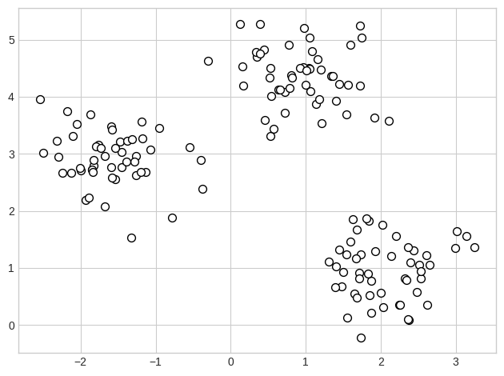

เมื่อได้ข้อมูลแล้วจึงนำมาแบ่งกลุ่มโดยใช้วิธีการ K-means โดยกำหนดให้มีกลุ่มข้อมูลทั้งหมด 3 กลุ่ม และกำหนดให้มีจุดเริ่มต้นของ centroid ที่สุ่มมาจากข้อมูล ดังนี้

```python
from sklearn.cluster import KMeans

km = KMeans(
    n_clusters=3, init='random',
    n_init=10, max_iter=300,
    tol=1e-04, random_state=0
)
y_km = km.fit_predict(X)
```

ทำการแสดงผลลัพธ์ที่ได้จากการแบ่งกลุ่มข้อมูล

```python
# plot the 3 clusters
plt.scatter(
    X[y_km == 0, 0], X[y_km == 0, 1],
    s=50, c='lightgreen',
    marker='s', edgecolor='black',
    label='cluster 1'
)

plt.scatter(
    X[y_km == 1, 0], X[y_km == 1, 1],
    s=50, c='orange',
    marker='o', edgecolor='black',
    label='cluster 2'
)

plt.scatter(
    X[y_km == 2, 0], X[y_km == 2, 1],
    s=50, c='lightblue',
    marker='v', edgecolor='black',
    label='cluster 3'
)

# plot the centroids
plt.scatter(
    km.cluster_centers_[:, 0], km.cluster_centers_[:, 1],
    s=250, marker='*',
    c='red', edgecolor='black',
    label='centroids'
)
plt.legend(scatterpoints=1)
plt.grid()
plt.show()
```

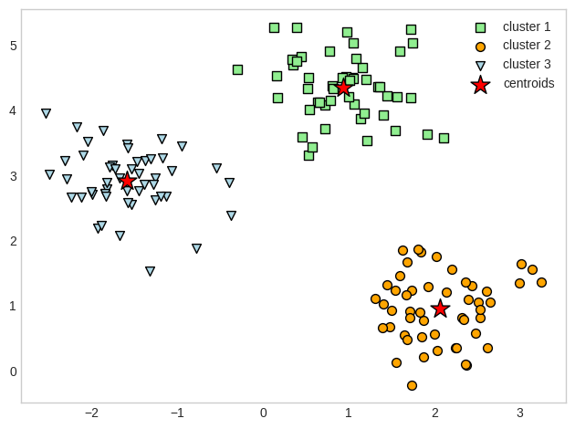

จากตัวอย่างนี้เรากำหนด k ไว้ที่ 3 หรือ 3 กลุ่มนั้นเอง แต่หากในกรณีที่เราไม่ทราบมาก่อนว่าข้อมูลควรมีกี่กลุ่มมีวิธีการใดบ้างที่จะใช้ในการหาจำนวนกลุ่มที่เหมาะสมให้กับข้อมูล เทคนิคที่นิยมในการหาค่า k เช่น Elbow Method หรือ Silhouette Method ซึ่งจะอธิบายต่อไป

### Elbow Method
วิธีการนี้ใช้ทำการทดลองในหลาย ๆ ค่าของ k และทำการหาค่าเฉลี่ยของระยะทางในแต่ข้อมูลกลุ่มเดียวกันมาทำการแสดงเป็นกราฟ ดังเช่นตัวอย่างด้านล่าง จุดที่วงไว้แสดงถึงจุด Elbow โดนเป็นจุดที่มีค่าลดลงอย่างรวดเร็วและหลังจากนั้นจะลดลงช้าลงเรื่อย ๆ จุดนี้จึงเป็นจุดที่เหมาะสมที่สุดในการเลือกค่า k ที่เหมาะสมกับข้อมูล

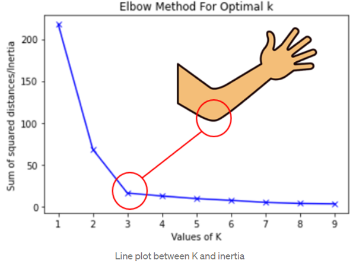

<sup>อ้างอิงภาพ https://www.analyticsvidhya.com/blog/2021/05/k-mean-getting-the-optimal-number-of-clusters/</sup>

ในบางกรณีจุด Elbow อาจจะสังเกตุยาก แนวทางการเลือกหนึ่งที่นำมาใช้คือ การลากเส้นตรงจากจุดแรกไปยังจุดสุดท้าย (เส้นสีแดงในภาพด้านล่าง) หาก ณ จุดใดที่ลากเส้นไปตั้งฉากกับเส้นดังกล่าวแล้วให้ความยาวของเส้นมากที่สุด จะเลือกจุดนั้นเป็น k ที่ดีที่สุด ดังตัวอย่างด้านล่าง เส้นสีเขียว ซึ่งลากจากตำแหน่งของ k=6 เป็นเส้นที่ลากไปตั้งฉากกับเส้นสีแดงและมีความยาวมากที่สุด ดังนั้นจึงเลือก k=6 เป็นค่าที่เหมาะสมที่สุด (หากลากเส้นไปตั้งฉากกับเส้นสีแดงจากตำแหน่ง k=7 หรือ k=5 ได้เส้นที่สั้นกว่า k=6 ดังนั้นจึงไม่เหมาะสม รวมถึงในตำแหน่ง k อื่น ๆ ก็เช่นเดียวกัน)

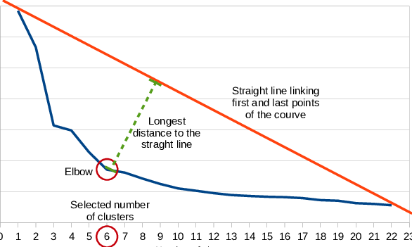

<sup>อ้างอิงภาพ https://www.researchgate.net/figure/Example-of-the-elbow-criterion-applied-over-the-curve-of-within-class-sum-of-squares-per_fig1_281443471</sup>

จากตัวอย่างข้างต้น เราจะใช้วิธีการ Elbow Method ในการหาค่า k จากโค้ดดังนี้
    
```python
# calculate distortion for a range of number of cluster
distortions = []
for i in range(1, 11):
    km = KMeans(
        n_clusters=i, init='random',
        n_init=10, max_iter=300,
        tol=1e-04, random_state=0
    )
    km.fit(X)
    distortions.append(km.inertia_)

# plot
plt.plot(range(1, 11), distortions, marker='o')
plt.xlabel('Number of clusters')
plt.ylabel('Distortion')
plt.show()
```

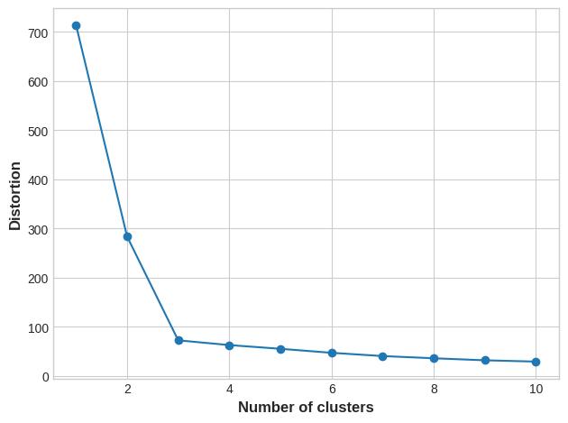

### Silhouette Method
วิธีการนี้จะดูระยะทางทั้งภายในกลุ่มเดียวกันและนอกกลุ่ม โดยใช้สูตรในการคำนวณดังนี้


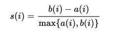


<sup>อ้างอิงภาพ https://medium.com/espressofx-notebook/การหาจำนวน-k-ที่เหมาะสมที่สุดด้วยวิธี-silhouette-b367fdae24d4</sup>


จากตัวอย่างข้างต้น เราจะใช้วิธีการ Silhouette Method ในการหาค่า k ดังนี้

```python

import matplotlib.cm as cm
import matplotlib.pyplot as plt
import numpy as np

from sklearn.cluster import KMeans
from sklearn.metrics import silhouette_samples, silhouette_score

range_n_clusters = [2, 3, 4, 5]

for n_clusters in range_n_clusters:
    # Create a subplot with 1 row and 2 columns
    fig, (ax1, ax2) = plt.subplots(1, 2)
    fig.set_size_inches(18, 7)

    # The 1st subplot is the silhouette plot
    # The silhouette coefficient can range from -1, 1 but in this example all
    # lie within [-0.1, 1]
    ax1.set_xlim([-0.1, 1])
    # The (n_clusters+1)*10 is for inserting blank space between silhouette
    # plots of individual clusters, to demarcate them clearly.
    ax1.set_ylim([0, len(X) + (n_clusters + 1) * 10])

    # Initialize the clusterer with n_clusters value and a random generator
    # seed of 10 for reproducibility.
    clusterer = KMeans(n_clusters=n_clusters, n_init="auto", random_state=10)
    cluster_labels = clusterer.fit_predict(X)

    # The silhouette_score gives the average value for all the samples.
    # This gives a perspective into the density and separation of the formed
    # clusters
    silhouette_avg = silhouette_score(X, cluster_labels)
    print(
        "For n_clusters =",
        n_clusters,
        "The average silhouette_score is :",
        silhouette_avg,
    )

    # Compute the silhouette scores for each sample
    sample_silhouette_values = silhouette_samples(X, cluster_labels)

    y_lower = 10
    for i in range(n_clusters):
        # Aggregate the silhouette scores for samples belonging to
        # cluster i, and sort them
        ith_cluster_silhouette_values = sample_silhouette_values[cluster_labels == i]

        ith_cluster_silhouette_values.sort()

        size_cluster_i = ith_cluster_silhouette_values.shape[0]
        y_upper = y_lower + size_cluster_i

        color = cm.nipy_spectral(float(i) / n_clusters)
        ax1.fill_betweenx(
            np.arange(y_lower, y_upper),
            0,
            ith_cluster_silhouette_values,
            facecolor=color,
            edgecolor=color,
            alpha=0.7,
        )

        # Label the silhouette plots with their cluster numbers at the middle
        ax1.text(-0.05, y_lower + 0.5 * size_cluster_i, str(i))

        # Compute the new y_lower for next plot
        y_lower = y_upper + 10  # 10 for the 0 samples

    ax1.set_title("The silhouette plot for the various clusters.")
    ax1.set_xlabel("The silhouette coefficient values")
    ax1.set_ylabel("Cluster label")

    # The vertical line for average silhouette score of all the values
    ax1.axvline(x=silhouette_avg, color="red", linestyle="--")

    ax1.set_yticks([])  # Clear the yaxis labels / ticks
    ax1.set_xticks([-0.1, 0, 0.2, 0.4, 0.6, 0.8, 1])

    # 2nd Plot showing the actual clusters formed
    colors = cm.nipy_spectral(cluster_labels.astype(float) / n_clusters)
    ax2.scatter(
        X[:, 0], X[:, 1], marker=".", s=30, lw=0, alpha=0.7, c=colors, edgecolor="k"
    )

    # Labeling the clusters
    centers = clusterer.cluster_centers_
    # Draw white circles at cluster centers
    ax2.scatter(
        centers[:, 0],
        centers[:, 1],
        marker="o",
        c="white",
        alpha=1,
        s=200,
        edgecolor="k",
    )

    for i, c in enumerate(centers):
        ax2.scatter(c[0], c[1], marker="$%d$" % i, alpha=1, s=50, edgecolor="k")

    ax2.set_title("The visualization of the clustered data.")
    ax2.set_xlabel("Feature space for the 1st feature")
    ax2.set_ylabel("Feature space for the 2nd feature")

    plt.suptitle(
        "Silhouette analysis for KMeans clustering on sample data with n_clusters = %d"
        % n_clusters,
        fontsize=14,
        fontweight="bold",
    )

plt.show()
```

จากตัวอย่างนี้ผลของการแบ่ง 3 กลุ่มให้ค่า silhouette score มีค่ามากที่สุด และจากกราฟมีการแบ่งข้อมูลที่เท่า ๆ กัน โดยไม่มีข้อมูลกลุ่มใดมีค่าต่ำกว่าค่าเฉลี่ย ดังนั้นจึงเหมาะสมที่สุด

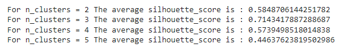

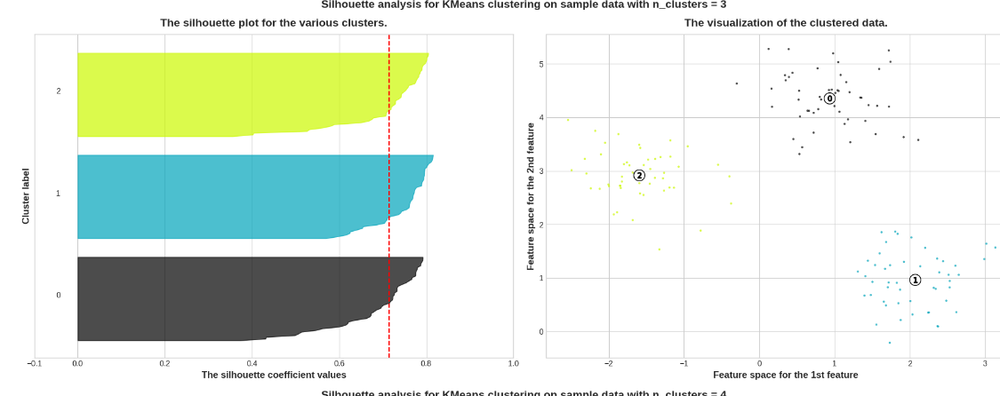

<sup>อ้างอิงโค้ด #Ref: https://scikit-learn.org/stable/auto_examples/cluster/plot_kmeans_silhouette_analysis.html#sphx-glr-auto-examples-cluster-plot-kmeans-silhouette-analysis-py</sup>

### ตัวอย่าง Housing Dataset
ในตัวอย่างนี้ใช้ [Housing Dataset](Datasets/housing.csv) โดยเริ่มต้นจากการนำเข้าข้อมูลและทำการแสดงข้อมูลดังนี้

```python
import matplotlib.pyplot as plt
import pandas as pd
import seaborn as sns
from sklearn.cluster import KMeans

plt.style.use("seaborn-whitegrid")
plt.rc("figure", autolayout=True)
plt.rc(
    "axes",
    labelweight="bold",
    labelsize="large",
    titleweight="bold",
    titlesize=14,
    titlepad=10,
)

df = pd.read_csv("housing.csv")
X = df.loc[:, ["MedInc", "Latitude", "Longitude"]]
X.head()
```

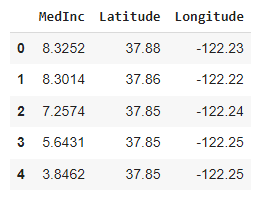

จากตัวอย่างนี้ลองทำการวิเคราะห์โดยใช้ Elbow Method ดังนี้

```python
# calculate distortion for a range of number of cluster
distortions = []
for i in range(1, 11):
    km = KMeans(
        n_clusters=i, init='random',
        n_init=10, max_iter=300,
        tol=1e-04, random_state=0
    )
    km.fit(X)
    distortions.append(km.inertia_)

# plot
plt.plot(range(1, 11), distortions, marker='o')
plt.xlabel('Number of clusters')
plt.ylabel('Distortion')
plt.show()
```

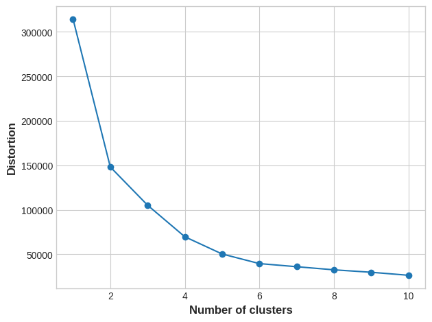

ซึ่งจะเห็นว่าอาจหาจุดที่เป็น Elbow ชัดเจนไม่ได้ ดังนั้นจึงลองใช้ Silhouette Method ดังนี้

```python
import matplotlib.cm as cm
import matplotlib.pyplot as plt
import numpy as np

from sklearn.metrics import silhouette_samples, silhouette_score

range_n_clusters = [2, 3, 4, 5, 6, 7, 8, 9, 10]
cluster_labels=range_n_clusters

for n_clusters in range_n_clusters:
    # Create a subplot with 1 row and 2 columns
    fig, (ax1, ax2) = plt.subplots(1, 2)
    fig.set_size_inches(18, 7)

    # The 1st subplot is the silhouette plot
    # The silhouette coefficient can range from -1, 1 but in this example all
    # lie within [-0.1, 1]
    ax1.set_xlim([-0.1, 1])
    # The (n_clusters+1)*10 is for inserting blank space between silhouette
    # plots of individual clusters, to demarcate them clearly.
    ax1.set_ylim([0, len(X) + (n_clusters + 1) * 10])

    # Initialize the clusterer with n_clusters value and a random generator
    # seed of 10 for reproducibility.
    clusterer = KMeans(n_clusters=n_clusters, n_init="auto", random_state=10)
    cluster_labels = clusterer.fit_predict(X)

    # The silhouette_score gives the average value for all the samples.
    # This gives a perspective into the density and separation of the formed
    # clusters
    silhouette_avg = silhouette_score(X, cluster_labels)
    print(
        "For n_clusters =",
        n_clusters,
        "The average silhouette_score is :",
        silhouette_avg,
    )

    # Compute the silhouette scores for each sample
    sample_silhouette_values = silhouette_samples(X, cluster_labels)

    y_lower = 10
    for i in range(n_clusters):
        # Aggregate the silhouette scores for samples belonging to
        # cluster i, and sort them
        ith_cluster_silhouette_values = sample_silhouette_values[cluster_labels == i]

        ith_cluster_silhouette_values.sort()

        size_cluster_i = ith_cluster_silhouette_values.shape[0]
        y_upper = y_lower + size_cluster_i

        color = cm.nipy_spectral(float(i) / n_clusters)
        ax1.fill_betweenx(
            np.arange(y_lower, y_upper),
            0,
            ith_cluster_silhouette_values,
            facecolor=color,
            edgecolor=color,
            alpha=0.7,
        )

        # Label the silhouette plots with their cluster numbers at the middle
        ax1.text(-0.05, y_lower + 0.5 * size_cluster_i, str(i))

        # Compute the new y_lower for next plot
        y_lower = y_upper + 10  # 10 for the 0 samples

    ax1.set_title("The silhouette plot for the various clusters.")
    ax1.set_xlabel("The silhouette coefficient values")
    ax1.set_ylabel("Cluster label")

    # The vertical line for average silhouette score of all the values
    ax1.axvline(x=silhouette_avg, color="red", linestyle="--")

    ax1.set_yticks([])  # Clear the yaxis labels / ticks
    ax1.set_xticks([-0.1, 0, 0.2, 0.4, 0.6, 0.8, 1])

    # 2nd Plot showing the actual clusters formed
    colors = cm.nipy_spectral(cluster_labels.astype(float) / n_clusters)
    ax2.scatter(
        X.iloc[:, 1], X.iloc[:, 2], marker=".", s=30, lw=0, alpha=0.7, c=colors, edgecolor="k"
    )

    # Labeling the clusters
    centers = clusterer.cluster_centers_
    # Draw white circles at cluster centers
    ax2.scatter(
        centers[:, 1],
        centers[:, 2],
        marker="o",
        c="white",
        alpha=1,
        s=200,
        edgecolor="k",
    )

    for i, c in enumerate(centers):
        ax2.scatter(c[1], c[2], marker="$%d$" % i, alpha=1, s=50, edgecolor="k")

    ax2.set_title("The visualization of the clustered data.")
    ax2.set_xlabel("Feature space for the 1st feature")
    ax2.set_ylabel("Feature space for the 2nd feature")

    plt.suptitle(
        "Silhouette analysis for KMeans clustering on sample data with n_clusters = %d"
        % n_clusters,
        fontsize=14,
        fontweight="bold",
    )

plt.show()
```

จากผลที่ได้จุดที่น่าสนใจคือ จุดที่ 4 5 และ 6 จึงทดลองแสดงผลการแบ่งข้อมูลโดยใช้กลุ่ม 4 กลุ่มได้ดังนี้
    
```python
# Create cluster feature
kmeans = KMeans(n_clusters=4)
X["Cluster"] = kmeans.fit_predict(X)
X["Cluster"] = X["Cluster"].astype("category")

X.head()
```

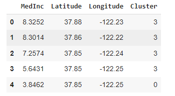


```python
sns.relplot(
    x="Longitude", y="Latitude", hue="Cluster", data=X, height=6,
);
```

<sup>อ้างอิงตัวอย่าง https://www.kaggle.com/code/ryanholbrook/clustering-with-k-means</sup>

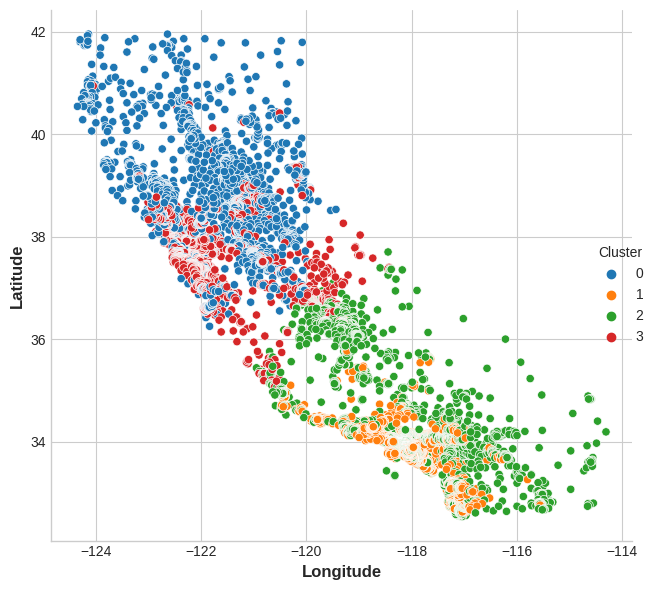

## การประยุกต์ใช้ K-means
ตัวอย่างการนำ K-means ไปใช้ประโยชน์ในการลดขนาดภาพ ดังตัวอย่างต่อไปนี้

```python
# Authors: Robert Layton <robertlayton@gmail.com>
#          Olivier Grisel <olivier.grisel@ensta.org>
#          Mathieu Blondel <mathieu@mblondel.org>
#
# License: BSD 3 clause

from time import time

import matplotlib.pyplot as plt
import numpy as np

from sklearn.cluster import KMeans
from sklearn.datasets import load_sample_image
from sklearn.metrics import pairwise_distances_argmin
from sklearn.utils import shuffle

n_colors = 64

# Load the Summer Palace photo
china = load_sample_image("china.jpg")

# Convert to floats instead of the default 8 bits integer coding. Dividing by
# 255 is important so that plt.imshow behaves works well on float data (need to
# be in the range [0-1])
china = np.array(china, dtype=np.float64) / 255

# Load Image and transform to a 2D numpy array.
w, h, d = original_shape = tuple(china.shape)
assert d == 3
image_array = np.reshape(china, (w * h, d))

print("Fitting model on a small sub-sample of the data")
t0 = time()
image_array_sample = shuffle(image_array, random_state=0, n_samples=1_000)
kmeans = KMeans(n_clusters=n_colors, n_init="auto", random_state=0).fit(
    image_array_sample
)
print(f"done in {time() - t0:0.3f}s.")

# Get labels for all points
print("Predicting color indices on the full image (K-means)")
t0 = time()
labels = kmeans.predict(image_array)
print(f"done in {time() - t0:0.3f}s.")


codebook_random = shuffle(image_array, random_state=0, n_samples=n_colors)
print("Predicting color indices on the full image (random)")
t0 = time()
labels_random = pairwise_distances_argmin(codebook_random, image_array, axis=0)
print(f"done in {time() - t0:0.3f}s.")


def recreate_image(codebook, labels, w, h):
    """Recreate the (compressed) image from the code book & labels"""
    return codebook[labels].reshape(w, h, -1)


# Display all results, alongside original image
plt.figure(1)
plt.clf()
plt.axis("off")
plt.title("Original image (96,615 colors)")
plt.imshow(china)

plt.figure(2)
plt.clf()
plt.axis("off")
plt.title(f"Quantized image ({n_colors} colors, K-means)")
plt.imshow(recreate_image(kmeans.cluster_centers_, labels, w, h))

plt.figure(3)
plt.clf()
plt.axis("off")
plt.title(f"Quantized image ({n_colors} colors, Random)")
plt.imshow(recreate_image(codebook_random, labels_random, w, h))
plt.show()
```

<sup>อ้างอิงตัวอย่าง https://scikit-learn.org/stable/auto_examples/cluster/plot_color_quantization.html#sphx-glr-auto-examples-cluster-plot-color-quantization-py</sup>

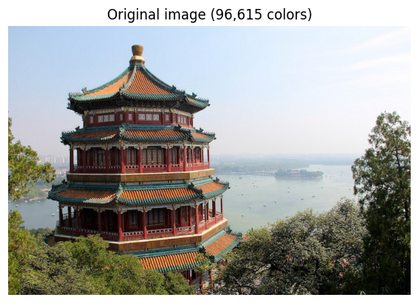

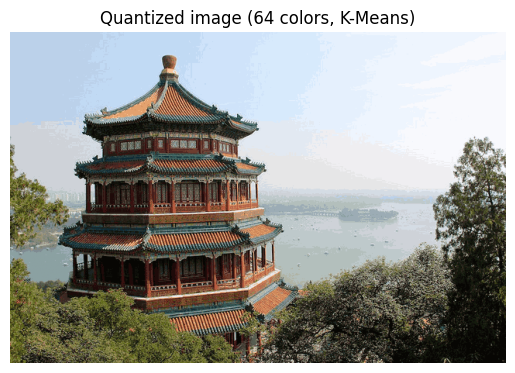

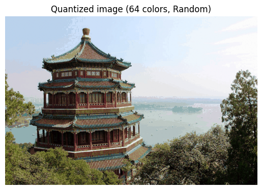


## การบ้าน

ใช้ข้อมูล [Ames Housing Dataset](Datasets/ames.csv) ในการทำ K-means และหา k ที่ดีที่สุดโดยใช้วิธีการ Elbow Method โดยทำการเรียกใช้ข้อมูลดังนี้

```python
import matplotlib.pyplot as plt
import pandas as pd
import seaborn as sns
from sklearn.cluster import KMeans

features=[
    "LotArea",
    "TotalBsmtSF",
    "FirstFlrSF",
    "SecondFlrSF",
    "GrLivArea",
]

plt.style.use("seaborn-whitegrid")
plt.rc("figure", autolayout=True)
plt.rc(
    "axes",
    labelweight="bold",
    labelsize="large",
    titleweight="bold",
    titlesize=14,
    titlepad=10,
)

df = pd.read_csv("ames.csv")
X = df.loc[:, features]
X.head()
```

ในตัวอย่างนี้ให้นักศึกษาทำการ Data Normalization ก่อนเนื่องจากมี Scale ข้อมูลที่ต่างกันมาก โดยใช้วิธีการที่เคยเรียนมาแล้วก่อนหน้านี้ได้ และทำการแสดงวิธีการหาค่า k ที่เหมาะสมโดยใช้ Elbow Method พร้อมววิเคราะห์ว่า k ที่ดีที่สุดควรเป็นค่าใด


<sup><ins>หมายเหตุ</ins> โค้ดและข้อความบางส่วนมีการใช้ Github Copilot ในการเขียน และปรับแก้บ้างส่วนเพื่อให้เหมาะสมกับเนื้อหา จึงอาจมีเนื้อหาจากแหล่งข้อมูลอื่นๆ ที่ไม่ได้ระบุมาในเอกสารนี้</sup>