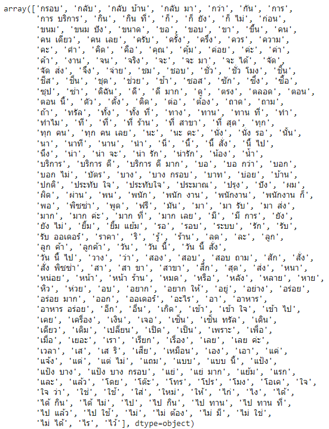

# Natural Language Processing (NLP) : การประมวลผลภาษาธรรมชาติ

Natural Language Processing (NLP) คือสาขาของวิทยาการคอมพิวเตอร์ที่เน้นการประมวลผลและเข้าใจภาษามนุษย์ได้  โดยสามารถนำไปใช้ประโยชน์ในการจัดการข้อความ การตีความ การแจำแนกประเภทข้อความ หรือการจัดกลุ่มเอกสารเป็นต้น


การทำงานขั้นพื้นฐานของ Natural Language Processing (NLP) ครอบครองหลายกระบวนการสำคัญที่เป็นการประมวลผลและเข้าใจภาษาธรรมเนียมด้วยคอมพิวเตอร์ กระบวนการเหล่านี้รวมถึง:

* Tokenization (ตัดคำ): กระบวนการแบ่งข้อความออกเป็นคำหรือโทเคน (tokens) โดยใช้เครื่องมือหรือข้อกำหนดทางภาษา เพื่อเตรียมข้อมูลให้สามารถนำเข้ากระบวนการประมวลผลต่อไป

* Parsing (การวิเคราะห์ประโยค): การวิเคราะห์โครงสร้างประโยคเพื่อเข้าใจความสัมพันธ์ระหว่างคำหรือความหมายของประโยค โดยสร้างต้นแบบประโยคหรือการวิเคราะห์ต้นแบบประโยค (parsing tree).

* Lemmatization/Stemming (การลดรูปคำ): กระบวนการลดรูปคำให้อยู่ในรูปแบบหลัก (root form) หรือคำหลัก เพื่อลดความหลากหลายของคำศัพท์ เช่น "running" กับ "ran" จะถูกลดรูปเป็น "run" ในกระบวนการนี้

* Part-of-Speech Tagging (การติดป้ายกำกับส่วนหนึ่งของคำ): การกำหนดป้ายกำกับ (tags) ให้กับคำแต่ละคำในประโยคเพื่อระบุบทส่วนของประโยคที่เป็นคำนาม (noun), คำกริยา (verb), คำวิเศษณ์ (adjective), หรืออื่น ๆ ซึ่งช่วยในการเข้าใจความหมายและสัมพันธ์ของคำในประโยค

* Language Detection (การตรวจสอบภาษา): การระบุภาษาที่ใช้ในข้อความหรือเนื้อหา เฉพาะมาก่อนการประมวลผลอื่น ๆ เพื่อให้ระบบทราบว่าจะใช้กฎหรือโมเดลทางภาษาที่ถูกต้อง

* Identification of Semantic Relationships (การระบุความสัมพันธ์ทางความหมาย): กระบวนการนี้เกี่ยวกับการระบุความสัมพันธ์ทางความหมายระหว่างคำหรือข้อความ เช่นการระบุความสัมพันธ์ทางความหมายระหว่างคำศัพท์ หรือการค้นหาคำที่เกี่ยวข้อง

การทำความเข้าใจและประมวลผลข้อความในรูปแบบเหล่านี้เป็นขั้นตอนสำคัญใน NLP และมีความสำคัญในการพัฒนาและประยุกต์ใช้ระบบ NLP ที่มีประสิทธิภาพในหลายแขนงอุตสาหกรรม เช่น การค้นหาข้อมูล, การสนับสนุนลูกค้า, การสร้างข้อความอัตโนมัติ, การจัดการข้อมูลลูกค้า, และอื่น ๆ 

โดยในเนื้อหาของบทนี้จะเน้นไปที่ Text Classification ในภาษาไทย ดังนั้นจะนำเสนอขั้นตอนและกระบวนการที่เกี่ยวข้องกับการประมวลผลภาษาธรรมชาติในภาษาไทย

## Preprocessing (การเตรียมข้อมูล)

### Text Cleaning

ในขั้นตอนนี้จะทำการเตรียมข้อมูลให้พร้อมสำหรับการประมวลผลต่อไป โดยจะเป็นการทำความสะอาดข้อมูล และเตรียมข้อมูลให้อยู่ในรูปแบบที่เหมาะสมกับการประมวลผลต่อไป เช่น การปรับรูปคำ การกำจัดเครื่องหมายวรรคตอน การตัดคำที่ไม่มีผลในการจำแนก (เช่น คำบุพบท) เป็นต้น


### Tokenization
เครื่องมือในการตัดคำ (Tokenization) สำหรับภาษาไทยมีหลายเครื่องมือให้เลือกใช้ เข่น DeepCut AtthaCut OSKut และ PyThaiNLP โดยมีตัวอย่างการใช้งานดังนี้
#### DeepCut
ที่มา : https://github.com/rkcosmos/deepcut

การติดตั้งเครื่องมือ DeepCut สามารถทำได้โดยใช้คำสั่งต่อไปนี้
```python
!pip install deepcut
```

การใช้งาน DeepCut สามารถทำได้ดังนี้
```python
import deepcut
deepcut.tokenize('จะออกไปแตะขอบฟ้า แต่เหมือนว่าโชคชะตาไม่เข้าใจ')
```

#### AttaCut
ที่มา: https://github.com/PyThaiNLP/attacut

การติดตั้งเครื่องมือ AtthaCut สามารถทำได้โดยใช้คำสั่งต่อไปนี้
```python
!pip install attacut
```

การใช้งาน AtthaCut สามารถทำได้ดังนี้
```python
from attacut import tokenize, Tokenizer

text = "จะออกไปแตะขอบฟ้า แต่เหมือนว่าโชคชะตาไม่เข้าใจ"

# tokenize using our best model `attacut-sc`
words = tokenize(text)

words
```


#### OSKut
ที่มา: https://github.com/mrpeerat/OSKut

การติดตั้งเครื่องมือ OSKut สามารถทำได้โดยใช้คำสั่งต่อไปนี้
```python
!pip install OSKut
!pip install sefr_cut
```

การใช้งาน OSKut สามารถทำได้ดังนี้
```python
import oskut
oskut.load_model(engine='ws')
print(oskut.OSKut('สวัสดีประเทศไทย'))
```

#### PyThaiNLP
ที่มา : https://pythainlp.github.io/docs/4.0/api/tokenize.html

การติดตั้งเครื่องมือ PyThaiNLP สามารถทำได้โดยใช้คำสั่งต่อไปนี้
```python
!pip install pythainlp
```


การใช้งาน PyThaiNLP สามารถทำได้ดังนี้ โดยสามารถเลือกใช้ Engine ได้หลายตัว เช่น attacut, deepcut, longest, mm, newmm, newmm-safe, oskut, sefr_cut, ulmfit, word_tokenize แต่ทั้งนี้ต้องติดตั้ง Engine ที่ต้องการใช้ก่อน

การตัดคำด้วยวิธีการ "longest" แตกต่างจาก "mm" (multi-cut) ดังนี้:

- **Longest Matching (longest)**: เป็นการตัดคำโดยเลือกตัดคำที่มีอักษรยาวที่สุดจาก Dictonary เพื่อหลีกเลี่ยงการตัดคำสั้น ๆ ออกมา


- **Maximum Matching (mm) - Multi-Cut**: วิธีการนี้จะพยายามตัดคำหลาย ๆ แบบ และเหลือผลการตัดที่ให้จำนวนคำน้อยที่สุด

```python
from pythainlp.tokenize import word_tokenize
text = "จะออกไปแตะขอบฟ้า แต่เหมือนว่าโชคชะตาไม่เข้าใจ"

words=word_tokenize(text, engine="attacut")
print(words)
print('')

words=word_tokenize(text, engine="deepcut")
print(words)
print('')

words=word_tokenize(text, engine="longest")
print(words)
print('')

words=word_tokenize(text, engine="mm")
print(words)
print('')

words=word_tokenize(text, engine="nercut")
print(words)
print('')

words=word_tokenize(text, engine="newmm")
print(words)
print('')

words=word_tokenize(text, engine="newmm-safe")
print(words)
print('')

words=word_tokenize(text, engine="oskut")
print(words)
print('')

words=word_tokenize(text, engine="sefr_cut")
print(words)
print('')
```

## Part-of-Speech (POS)
แหล่งข้อมูล : https://pythainlp.github.io/dev-docs/api/tag.html

POS เป็นการติดป้ายกำกับส่วนหนึ่งของคำ (Part-of-Speech) โดยจะกำหนดป้ายกำกับ (tags) ให้กับคำแต่ละคำในประโยคเพื่อระบุบทส่วนของประโยคที่เป็นคำนาม (noun), คำกริยา (verb), คำวิเศษณ์ (adjective), หรืออื่น ๆ ซึ่งช่วยในการเข้าใจความหมายและสัมพันธ์ของคำในประโยค

```python
from pythainlp.tag import pos_tag, pos_tag_sents

text = "จะออกไปแตะขอบฟ้า แต่เหมือนว่าโชคชะตาไม่เข้าใจ"

words=word_tokenize(text, engine="longest")

pos_tag(words)
```

```python
pos_tag(words, corpus='pud')

```

## Text Representation
การแสดงผลข้อความ (Text Representation) คือการแปลงข้อความให้อยู่ในรูปแบบที่เหมาะสมกับการประมวลผลต่อไป เช่น การแปลงข้อความให้อยู่ในรูปแบบเวกเตอร์ (Vector) หรือเป็นต้น ตัวอย่างการแสดงผลข้อความด้วยเวกเตอร์ เช่น การใช้ CountVectorizer, TF-IDF และ Word2Vec เป็นต้น

### CountVectorizer 
ในวิธีการนี้จำเป็นการนับคำที่ปรากฏในข้อความ เนื่องจาก Features (Attibutes) เกิดจากคำที่ไม่ซ้ำกันในทุกข้อความมารวมกัน ผลที่ได้จะทำให้ข้อมูลที่ Features จำนวนมาก และส่วนใหญ่เป็นค่าศูนย์ หรือเรียกว่า Sparse Matrix เช่น หากเรามีข้อความสองข้อความคือ
'Hello my name is james' และ 'this is my python notebook' ผลจะได้เป็นดังนี้


<sup>อ้างอิงภาพ : https://towardsdatascience.com/basics-of-countvectorizer-e26677900f9c</sup>


```python
from sklearn.feature_extraction.text import CountVectorizer

def identity_fun(text):
    return text.split()

vec = CountVectorizer(
    analyzer = 'word', 
    tokenizer=identity_fun, 
    ngram_range=(1,3),
    max_features=300
)
vec.fit_transform(df_train['text'])
```

จากตัวอย่างโค้ดนี้มีการกำหนด ngarm_range ซึ่ง Features จะเกิดจากคำที่อยู่ติดกัน โดยกำหนดให้เป็นคำที่อยู่ติดกัน 1 คำ 2 คำ และ 3 คำ โดยเรียกว่า  N-gram ที่ขนาด 1 ว่า unigram ขนาด 2 ว่า bigram และขนาด 3 ว่า trigram ตัวอย่างข้อความที่ใช้ในการสร้าง Features ดังนี้

"The Margherita pizza is not bad taste" จะได้ 1-Gram 2-Gram และ 3-Gram ดังนี้


<sup>อ้างอิงภาพ : https://studymachinelearning.com/an-introduction-to-n-grams/</sup>

โดยคำหรือกลุ่มคำเหล่านี้จะใช้เป็น Features ต่อไป

### TF-IDF (Term Frequency - Inverse Document Frequency)

วิธีนี้ไม่ได้ใช้การนับจำนวนโดยตรงแบบ CountVectorizer แต่จะใช้ความถี่ของคำที่ปรากฏในข้อความ โดยคำนวณจาก Term Frequency (TF) และ Inverse Document Frequency (IDF) ซึ่งเป็นการคำนวณความถี่ของคำที่ปรากฏในข้อความ โดยคำนวณดังนี้


<sup>อ้างอิงภาพ : https://medium.com/@witchapongdaroontham/ขั้นตอนการเตรียมข้อมูลประเภท-text-ภาษาไทย-แบบง่ายๆ-โดยใช้-python-simple-thai-text-preprocessing-c8c46ca3ce46</sup>


Term Frequency จะมีค่ามากหากคำดังกล่าวปรากฏในข้อความหลาย ๆ ข้อความ และมีค่าน้อยหากคำดังกล่าวปรากฏในข้อความน้อย ๆ หรือปรากฏครั้งเดียว ส่วน Inverse Document Frequency ใช้ในการถ่วงดุลโดยหากคำปรากฏในข้อความเกือบทุกข้อความส่วนนี้จะช่วยลดค่าลง โดยคำที่ปรากฏเกือบทุกข้อความอาจจะเป็นคำกลุ่ม article หรือ preposition ซึ่งไม่มีผลในการจำแนกข้อความ ตัวอย่างโค้ดการใช้งานดังนี้

```python
from sklearn.feature_extraction.text import TfidfVectorizer

def identity_fun(text):
    return text.split()

tfidf = TfidfVectorizer(
    analyzer = 'word', 
    tokenizer=identity_fun, 
    ngram_range=(1,3),
    max_features=300
)

tfidf.fit_transform(df_train['text'])
```

เมื่อได้ Features จากการแสดงผลข้อความด้วยเวกเตอร์แล้ว จะสามารถนำไปใช้ในการประมวลผลต่อไปได้ เช่น การจัดกลุ่มข้อความ หรือการจำแนกประเภทข้อความ เป็นต้น

## ตัวอย่างการจำแนกข้อความ (Text Classification)
โดยใช้ข้อมูล และไฟล์สำหรับแสดง font ไทย ดังนี้

- [Dataset](Datasets/burgerking-UTF8-traindataset-3.csv)
- [Font-Thai](Datasets/THSarabunNew.ttf)


### โหลดข้อมูล
```python
#ref: https://github.com/JagerV3/sentiment_analysis_thai

import pandas as pd
df=pd.read_csv('burgerking-UTF8-traindataset-3.csv')
df=df.rename(columns={'class':'class_label','message':'text'})
df
```

### เตรียมข้อมูล

```python
import re
import string
from pythainlp.corpus.common import thai_stopwords
from pythainlp.tokenize import word_tokenize

thai_stopwords = list(thai_stopwords())
thai_stopwords

def perform_removal(word):
    #กำจัดช่องว่างก่อน/หลังคำ
    word = word.strip()

    #เปลี่ยนภาษาอังกฤษเป็นตัวอักษรตัวเล็ก
    word = word.lower()

    #กำจัดเครื่องหมายวรรคตอน
    word = word.translate(str.maketrans('','', string.punctuation))

    #กำจัด stop words และตัวเลขโดดๆ
    if(word.isdigit() ):
        return ""
    else:
        return word

def clean_text(text):
  text = "".join(u for u in text if u not in ("?", ".", ";", ":", "!", '"', "ๆ", "ฯ","'"))
  tokens=word_tokenize(text, engine="oskut", keep_whitespace=False)

  tokens = [word for word in tokens if word.lower not in thai_stopwords]

  tokens = [word for word in tokens if len(word)>1]

  tokens = [perform_removal(word) for word in tokens]


  text = ' '.join(tokens)
  return text
```
<sup>อ้างอิงโค้ด : [Big Data Thailand](https://bigdata.go.th/big-data-101/word2vec-ii/)</sup>


```python
df['text'] = df['text'].apply(lambda x:clean_text(x))
```

### Word Cloud
ข้อความเชิงบวก
```python
from wordcloud import WordCloud, STOPWORDS
import matplotlib.pyplot as plt

df_pos = df[df['class_label'] == 1]
pos_word_all = " ".join(text for text in df_pos['text'])
reg = r"[ก-๙a-zA-Z']+"
fp = 'THSarabunNew.ttf'
wordcloud = WordCloud(stopwords=thai_stopwords, background_color = 'white', max_words=2000, height = 2000, width=4000, font_path=fp, regexp=reg).generate(pos_word_all)
plt.figure(figsize = (16,8))
plt.imshow(wordcloud)
plt.axis('off')
plt.show()
```


ข้อความเชิงลบ
```python
df_neg = df[df['class_label'] == 0]
neg_word_all = " ".join(text for text in df_neg['text'])
wordcloud = WordCloud(stopwords=thai_stopwords, background_color = 'white', max_words=2000, height = 2000, width=4000, font_path=fp, regexp=reg).generate(neg_word_all)
plt.figure(figsize = (16,8))
plt.imshow(wordcloud)
plt.axis('off')
plt.show()
```


<sup>อ้างอิงโค้ด : [เขียน Python สร้างแบบจำลองการวิเคราะห์รู้สึก (Sentiment Analysis) สำหรับภาษาไทย](https://karnyong.medium.com/เขียน-python-สร้างแบบจำลองการวิเคราะห์รู้สึก-sentiment-analysis-สำหรับภาษาไทย-cdb43de08e9a
)</sup>
### CountVectorizer & TF-IDF
```python
from sklearn.model_selection import train_test_split
df_train, df_test = train_test_split(df, test_size=0.20, stratify=df['class_label'])

from sklearn.feature_extraction.text import CountVectorizer,TfidfVectorizer

def identity_fun(text):
    return text.split()

'''
# CountVectorizer
vec = CountVectorizer(
    analyzer = 'word', #this is default
    tokenizer=identity_fun, #does no extra tokenizing
    ngram_range=(1,3),
    max_features=300
)
'''

#TFIDF
vec = TfidfVectorizer(
    analyzer = 'word', #this is default
    tokenizer=identity_fun, #does no extra tokenizing
    ngram_range=(1,3),
    max_features=300
)


vec.fit(df_train['text'])
vec.vocabulary_
```


```python
vec.get_feature_names_out()
```



### Show Data
```
import numpy as np

#สุ่มช่วงของ 5 เอกสารที่ติดกันมาทดลองใช้งาน
count_vector= vec.transform(df_train['text'][:10])
count_array = np.array(count_vector.todense())

#แปลงเป็น DataFrame เพื่อง่ายแก่การอ่าน
df_x = pd.DataFrame(count_array,columns=vec.get_feature_names_out())
df_x
```

### Transform
```
X_train = vec.transform(df_train.text)
X_test = vec.transform(df_test.text)

y_train = df_train['class_label']
y_test = df_test['class_label']
```

### Feature Selection
หากจำนวน Features มีมากเกินไป ต้องการเลือก Feature ที่สำคัญเพียงบางตัวสามารถทำได้โดยใช้วิธีการต่างๆ เช่น การใช้ SelectKBest หรือ SelectPercentile ซึ่งเป็นวิธีการที่ใช้ในการเลือก Feature ที่มีความสำคัญสูงสุด โดยใช้วิธีการทางสถิติ เช่น การคำนวณค่าสถิติต่างๆ เช่น ANOVA, Chi-Square, F-Test, Mutual Information และ Variance Threshold เป็นต้น 

ตัวอย่างต่อไปนี้ใช้วิธีการ Mutual Information ในการเลือก Features จำนวน 200 Features จาก 300 Features 

```python
# Transform (TF-IDF)
from sklearn.feature_selection import SelectKBest, mutual_info_classif

tfidf_train=vec.fit_transform(df_train.text)
tfidf_train = pd.DataFrame(np.array(tfidf_train.todense()),columns=vec.get_feature_names_out())

y_train = df_train['class_label']
y_test = df_test['class_label']

# Feature Selection
selector = SelectKBest(score_func=mutual_info_classif, k=200)
X_new = selector.fit_transform(tfidf_train, df_train.class_label)
X_train = pd.DataFrame(X_new,columns=selector.get_feature_names_out())

tfidf_test=vec.transform(df_test.text)
tfidf_test = pd.DataFrame(np.array(tfidf_test.todense()),columns=vec.get_feature_names_out())
X_test = selector.fit_transform(tfidf_test, df_test.class_label)

```


### Decision Tree Classification
```
from sklearn.tree import DecisionTreeClassifier
from sklearn.metrics import accuracy_score, cohen_kappa_score, f1_score, classification_report

dt=DecisionTreeClassifier()
dt.fit(X_train, y_train)

preds = dt.predict(X_test)
print(classification_report(y_test, preds))
```


```
from sklearn.tree import export_graphviz
import graphviz

# Export decision tree to graphviz format
dot_data = export_graphviz(dt, out_file=None, 
                           feature_names = selector.get_feature_names_out(), 
                           class_names=['Neg','Pos'],  
                           filled=True, rounded=True,  
                           special_characters=True)

# Visualize decision tree using graphviz
graph = graphviz.Source(dot_data)
graph.format = 'png' 
graph.render("burger_decision_tree")
graph # Display decision tree
```


<sup><ins>หมายเหตุ</ins> โค้ดและข้อความบางส่วนมีการใช้ Github Copilot และ ChatGPT ในการเขียน และปรับแก้บ้างส่วนเพื่อให้เหมาะสมกับเนื้อหา จึงอาจมีเนื้อหาจากแหล่งข้อมูลอื่นๆ ที่ไม่ได้ระบุการอ้างอิงในเอกสารนี้</sup>


## การบ้าน
ให้นักศึกษาทำการจำแนกข้อความจากความเห็นเชิงบวกและลบ โดยใช้ข้อมูล [Pizza](Datasets/pizza-UTF8-traindataset-3.csv) ในการจำแนกข้อความตามขั้นตอนที่ได้เรียนรู้ในบทนี้ กำหนดให้ใช้ CounterVectorizer ในการแสดงข้อความ และเลือก Features ที่ดีที่สุดจำนวน โดยใช้วิธีการของ Feature Selection - Mutual Information ในการเลือก Features ที่ดี โดยให้ลองหาจำนวนที่เหมาะสมมา

<sup>ที่มา Dataset ตัวอย่างและการบ้าน : https://github.com/JagerV3/sentiment_analysis_thai</sup>

## แหล่งข้อมูลเพิ่มเติม
- [PyThaiNLP](https://pythainlp.github.io/docs/4.0/index.html)
- [NLP For Thai](https://nlpforthai.com/)
- [Text Classification Corpus](https://nlpforthai.com/tasks/text-classification/)
- [ส่องสถานการณ์ NLP ในไทย กับเวิร์กชอป The future of Thai NLP](https://medium.com/@newnaveen/ส่องสถานการณ์-nlp-ในไทย-กับเวิร์กชอป-the-future-of-thai-nlp-9209f63e7c53)
